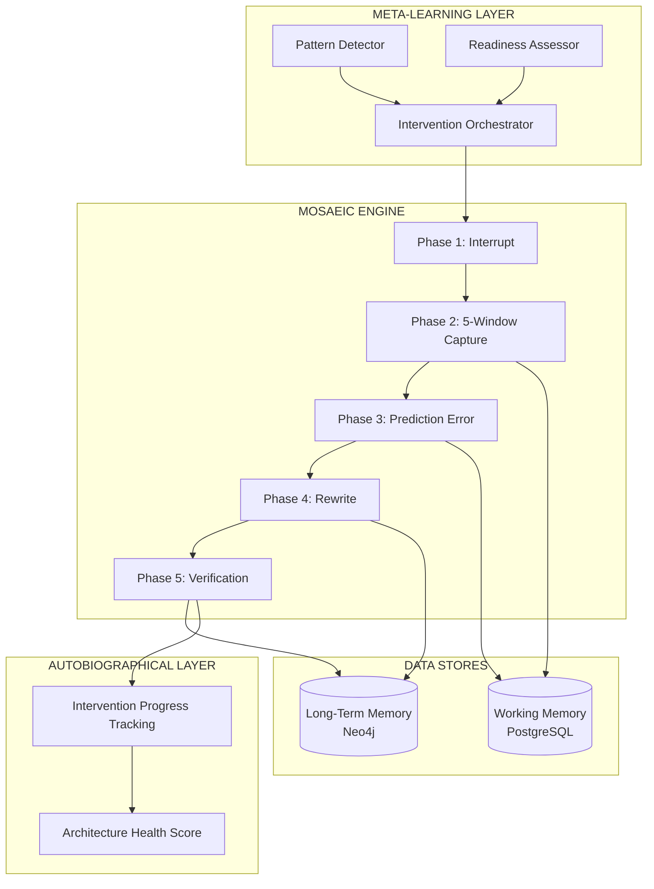

# Feature Specification: MoSAEIC Protocol (Self-Architecture Reconstruction)

**Feature Branch**: `009-mosaeic-protocol`
**Created**: 2025-12-22
**Status**: Draft
**Input**: Active refactoring engine for self-architecture reconstruction using therapeutic memory reconsolidation framework

## Overview

MoSAEIC (**M**indful **o**bservation of **S**enses, **A**ctions, **E**motions, **I**mpulses, and **C**ognitions) is a 5-phase therapeutic intervention protocol that enables self-architecture reconstruction through memory reconsolidation. It operates as a vertical process initiated by the Meta-Learning Layer when maladaptive patterns are detected, creating prediction errors to unlock neural pathways for belief rewriting.

## User Scenarios & Testing *(mandatory)*

### User Story 1 - Pattern Interrupt Detection (Priority: P1) 🎯 MVP

The system detects when a user exhibits a maladaptive pattern (repeated negative thought, behavior, or emotional response) and initiates the MoSAEIC intervention protocol.

**Why this priority**: Without detection, no intervention can occur. This is the entry point for all therapeutic work.
**Independent Test**: System can identify recurring negative patterns and flag them for intervention.

**Acceptance Scenarios**:
1. **Given** a user's history of memories and predictions, **When** the same negative pattern appears 3+ times within a week, **Then** the system flags it as a potential maladaptive pattern for intervention.
2. **Given** a flagged pattern, **When** the Meta-Learning Layer analyzes it, **Then** it determines if MoSAEIC intervention is appropriate based on pattern severity and user readiness.
3. **Given** an approved intervention, **When** the user next exhibits the pattern, **Then** the system initiates Phase 1 (Interrupt) with appropriate timing.

---

### User Story 2 - 5-Window Data Capture (Priority: P1) 🎯 MVP

During an active intervention, the system guides the user through capturing data across all 5 MoSAEIC windows: Senses, Actions, Emotions, Impulses, and Cognitions.

**Why this priority**: Comprehensive data capture is essential for identifying the belief structure to rewrite.
**Independent Test**: User can complete a full 5-window capture session and data is stored for analysis.

**Acceptance Scenarios**:
1. **Given** an initiated intervention, **When** the user engages with Phase 2, **Then** the system prompts for each window in sequence: Senses, Actions, Emotions, Impulses, Cognitions.
2. **Given** a window prompt, **When** the user provides input, **Then** the system captures the data with timestamp and emotional intensity rating.
3. **Given** all 5 windows captured, **When** the session completes, **Then** the system synthesizes a coherent snapshot of the triggering experience.

---

### User Story 3 - Prediction Error Generation (Priority: P1) 🎯 MVP

The system generates a prediction error by identifying the mismatch between the user's believed outcome and observed reality, creating the window for belief reconsolidation.

**Why this priority**: Prediction error is the core mechanism that unlocks neural pathways for rewriting.
**Independent Test**: Given captured data, system can identify belief-reality mismatch and articulate it clearly.

**Acceptance Scenarios**:
1. **Given** completed 5-window data, **When** the system analyzes the pattern, **Then** it identifies the core belief (what the user expected to happen).
2. **Given** the core belief, **When** compared to observed outcomes, **Then** the system calculates the prediction error magnitude.
3. **Given** significant prediction error (>50% mismatch), **When** presented to user, **Then** it creates cognitive dissonance that enables reconsolidation.

---

### User Story 4 - Belief Rewrite Session (Priority: P2)

The system guides the user through rewriting the maladaptive belief during the reconsolidation window (typically 5-hour window after prediction error).

**Why this priority**: Rewriting transforms insight into lasting change, but requires the mismatch phase to complete first.
**Independent Test**: User can complete a rewrite session and new belief is stored in long-term memory.

**Acceptance Scenarios**:
1. **Given** an active reconsolidation window, **When** the user engages with Phase 4, **Then** the system presents the old belief and prompts for alternative interpretations.
2. **Given** user-generated alternatives, **When** the system evaluates them, **Then** it identifies which alternatives are more adaptive (evidence-based, less catastrophic, more nuanced).
3. **Given** a selected new belief, **When** stored in long-term memory, **Then** it is linked to the same contextual triggers as the old belief.

---

### User Story 5 - Verification and Integration (Priority: P2)

The system verifies the rewrite by tracking future encounters with the trigger and measuring whether the new belief activates instead of the old one.

**Why this priority**: Verification ensures the intervention succeeded and enables iterative refinement.
**Independent Test**: System can track trigger encounters and compare response patterns before/after intervention.

**Acceptance Scenarios**:
1. **Given** a completed rewrite, **When** the user encounters the trigger context again, **Then** the system logs which belief (old or new) activates.
2. **Given** 3 post-intervention trigger encounters, **When** analyzed, **Then** the system calculates intervention success rate (% new belief activation).
3. **Given** success rate <70%, **When** flagged, **Then** the system recommends a follow-up intervention session.

---

### User Story 6 - Intervention History and Progress (Priority: P3)

Users can view their intervention history, track progress on multiple maladaptive patterns, and see their overall self-architecture reconstruction journey.

**Why this priority**: Progress visibility supports long-term engagement but isn't required for core functionality.
**Independent Test**: User can view dashboard showing all interventions, success rates, and patterns addressed.

**Acceptance Scenarios**:
1. **Given** a user with intervention history, **When** they request progress view, **Then** they see all interventions sorted by recency with success indicators.
2. **Given** multiple interventions, **When** aggregated, **Then** user sees overall architecture health score based on combined success rates.
3. **Given** a specific intervention, **When** viewed in detail, **Then** user can see the original belief, new belief, and activation history.

---

## Edge Cases

- **What happens if user abandons intervention mid-session?** Answer: Session saved as incomplete, can resume within 24 hours or restart.
- **How does system handle rapid mood shifts during intervention?** Answer: Pause and offer grounding exercise, can resume when stable.
- **What if user cannot identify the core belief?** Answer: System offers common belief templates based on pattern type.
- **How does system handle conflicting beliefs about same trigger?** Answer: Address most activated belief first, queue others.
- **What if reconsolidation window expires?** Answer: Reactivation required - replay capture summary to re-open window.

## Five-Window Content Mapping

Each MoSAEIC window captures a distinct dimension of experience:

| Window | Content | Purpose | Neural Substrate |
|--------|---------|---------|------------------|
| **Senses** | Physical sensations (internal & external), body state, environmental stimuli | Ground truth of current state | Insula, somatosensory cortex, sensory cortices |
| **Actions** | What was executed, behavioral responses, motor output | Behavioral manifestation of pattern | Motor cortex, premotor cortex, basal ganglia |
| **Emotions** | Feelings, affective tone, valence (safe/unsafe, good/bad) | Emotional context and priority weighting | Amygdala, vmPFC, limbic circuits |
| **Impulses** | Urges, action tendencies, behavioral drives (what user *wanted* to do) | Pre-conscious action selection | Basal ganglia, orbitofrontal cortex, anterior cingulate |
| **Cognitions** | Thoughts, interpretations, meanings, automatic appraisals, predictions | Semantic/narrative layer (core belief) | Lateral/medial PFC, lateral temporal cortex, angular gyrus |

**Integration**: Hippocampus binds all five windows into a coherent episodic trace via theta oscillations and cross-frequency coupling, creating a unified memory available for reconsolidation.

## Requirements *(mandatory)*

### Functional Requirements

#### Phase 1 - Interrupt
- **FR-001**: System MUST detect maladaptive patterns based on configurable criteria (recurrence, emotional intensity, impact).
- **FR-002**: System MUST determine intervention appropriateness based on user readiness signals.
- **FR-003**: System MUST initiate interrupt at optimal timing (not during crisis, with user consent).
- **FR-004**: System MUST provide clear explanation of what's happening and why intervention is recommended.

#### Phase 2 - Data Capture (5 Windows)
- **FR-005**: System MUST guide capture of **Senses** (interoceptive & exteroceptive: physical sensations, body state, environment).
- **FR-006**: System MUST guide capture of **Actions** (what user did, executed behaviors).
- **FR-007**: System MUST guide capture of **Emotions** (feelings, affective tone, emotional valence).
- **FR-008**: System MUST guide capture of **Impulses** (urges, behavioral drives, what user wanted to do).
- **FR-009**: System MUST guide capture of **Cognitions** (thoughts, interpretations, meanings, automatic appraisals).
- **FR-010**: System MUST allow rating of emotional intensity (1-10 scale) for each window.
- **FR-011**: System MUST synthesize captured data into coherent experience snapshot.

#### Phase 3 - Mismatch / Prediction Error
- **FR-012**: System MUST identify core belief from captured data (the prediction the brain made).
- **FR-013**: System MUST identify observed outcome from Senses/Actions windows (ground-truth sensory data, not interpretation).
- **FR-014**: System MUST calculate prediction error magnitude (belief vs reality gap).
- **FR-015**: System MUST present mismatch in way that creates cognitive dissonance.
- **FR-016**: System MUST track when reconsolidation window opens (timestamp of mismatch recognition).

#### Phase 4 - Rewrite
- **FR-017**: System MUST present old belief clearly and neutrally.
- **FR-018**: System MUST prompt for alternative interpretations/beliefs.
- **FR-019**: System MUST evaluate alternatives for adaptiveness (evidence, nuance, flexibility).
- **FR-020**: System MUST help user select most adaptive new belief.
- **FR-021**: System MUST store new belief linked to same triggers as old belief.
- **FR-022**: System MUST complete rewrite within reconsolidation window (configurable, default 4 hours).

#### Phase 5 - Verification
- **FR-023**: System MUST track future trigger encounters.
- **FR-024**: System MUST detect which belief activates (old or new) per encounter.
- **FR-025**: System MUST calculate intervention success rate after 3 encounters.
- **FR-026**: System MUST flag interventions with <70% success for follow-up.
- **FR-027**: System MUST update autobiographical narrative with successful rewrites.

#### Cross-Phase
- **FR-028**: System MUST persist intervention state for session recovery.
- **FR-029**: System MUST provide grounding exercises if user becomes distressed.
- **FR-030**: System MUST log all phases for intervention history.

### Key Entities

- **MaladaptivePattern**: Detected recurring negative pattern (attributes: `id`, `triggercontext`, `beliefcontent`, `recurrencecount`, `lastoccurrence`, `severityscore`, `interventionstatus`).
- **MOSAEICIntervention**: A complete intervention instance (attributes: `id`, `patternid`, `phase` [1-5], `startedat`, `completedat`, `status` [active/paused/completed/abandoned]).
- **FiveWindowCapture**: Data from Phase 2 (attributes: `id`, `interventionid`, `sensescontent`, `actionscontent`, `emotionscontent`, `impulsescontent`, `cognitionscontent`, `intensityratings` per window).
- **PredictionError**: The mismatch calculation (attributes: `id`, `interventionid`, `oldbelief`, `observedoutcome`, `errormagnitude`, `windowopenedat`, `windowexpiresat`).
- **BeliefRewrite**: The new belief (attributes: `id`, `interventionid`, `oldbeliefid`, `newbeliefcontent`, `adaptivenessscore`, `createdat`).
- **VerificationEncounter**: Post-intervention trigger tracking (attributes: `id`, `interventionid`, `triggeroccurredat`, `beliefactivated` [old/new], `contextnotes`).

## Success Criteria *(mandatory)*

### Measurable Outcomes
- **SC-001**: Pattern detection identifies 80% of recurring maladaptive patterns within 1 week of third occurrence.
- **SC-002**: Users complete 5-window capture in under 15 minutes.
- **SC-003**: Prediction error generation produces user-recognized "aha" moment in 70% of interventions.
- **SC-004**: Belief rewrites are completed within the reconsolidation window 90% of the time.
- **SC-005**: Intervention success rate (new belief activation) averages 60% across all completed interventions.
- **SC-006**: Users who complete 3 interventions report improved self-understanding in follow-up surveys.
- **SC-007**: Abandoned intervention rate is <30%.
- **SC-008**: System correctly identifies core beliefs validated by user confirmation in 75% of cases.

## Architecture Overview

## Neuroscience Grounding

MoSAEIC is anchored in empirically validated neural mechanisms:

- **Phase 1 (Interrupt)**: Medial prefrontal cortex (mPFC) + anterior cingulate cortex (ACC) detect conflict/errors; striatum tracks habit persistence; locus coeruleus (LC) signals uncertainty.
- **Phase 2 (5-Window Capture)**: Distributed cortical networks process each window; hippocampus binds them into coherent episodic trace.
- **Phase 3 (Prediction Error)**: Hippocampal pattern disruption + phasic neuromodulatory signaling (dopamine, noradrenaline) opens reconsolidation window.
- **Phase 4 (Rewrite)**: Prefrontal cortex (dlPFC, vmPFC) provides top-down control; hippocampus re-encodes updated associations during protein-synthesis window.
- **Phase 5 (Verification)**: Repeated trigger encounters test whether new belief activates; dopaminergic prediction error tracking adjusts confidence in updated model.

**Systems Consolidation**: Episodic traces (hippocampus-dependent) undergo consolidation to semantic beliefs (neocortex-dependent) via repeated pattern extraction; MoSAEIC targets this semantic layer during reconsolidation.

## Key Concept Definitions

- **Maladaptive Pattern**: A recurring thought, behavior, or emotional response that systematically violates user goals or generates negative prediction errors.
- **Prediction Error**: The mismatch between what the brain predicted (core belief) and what actually occurred (observed outcome), measured in magnitude.
- **Reconsolidation Window**: A 4-5 hour period post-prediction-error during which memory traces are labile and protein-synthesis-dependent, permitting modification before restabilization.
- **Core Belief**: The semantic model (not a specific episodic fact) that generates the prediction; exists as a stable pattern in neocortex until destabilized.
- **Adaptiveness Score**: Confidence/reliability metric for beliefs; high scores (99%) persist indefinitely; low scores (<40%) are candidates for rewrite.
- **Turning Point**: Episodic memory flagged for permanent retention (exempt from time-based decay) due to high emotional arousal, surprise, and consequentiality.

## Assumptions

- Users are willing to engage in structured self-reflection exercises.
- Memory reconsolidation principles from neuroscience research apply to belief updating.
- Reconsolidation window is 4-5 hours post-prediction-error (FR-022 default: 4 hours). This window reflects protein-synthesis-dependent plasticity; if expired, reactivation via Phase 2 replay is required to reopen.
- Users can accurately report their mental/emotional states when prompted.
- Pattern detection has sufficient historical data (minimum 2 weeks of interaction).

## Dependencies

- **Mental Models system**: `005-mental-models` for belief representation.
- **Memory consolidation infrastructure**: `007-memory-consolidation` for reconsolidation.
- **Heartbeat/Active Inference system**: for pattern monitoring.
- **Long-term memory**: Neo4j via n8n for belief storage.
- **Working memory**: PostgreSQL for intervention state.
