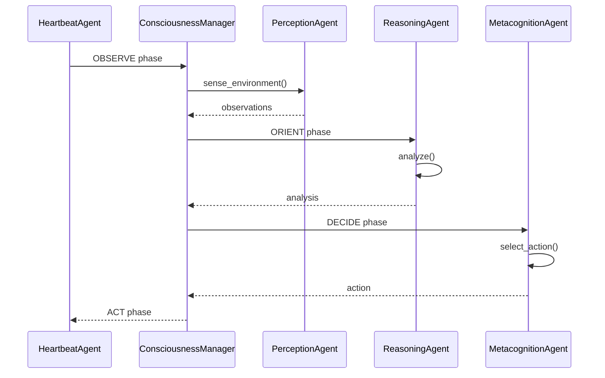

# Feature 062: Document Ingestion Pipeline & Cognitive Trajectory Visualizer

## Overview

Upgrade document ingestion with Marker-based PDF extraction, RLM-style recursive processing for long documents, and build a cognitive trajectory visualizer for OODA loop analysis.

## Background

### Current State

**Extraction Stack:**
- `scripts/generic_pdf_extract.py` - Basic pypdf (26 lines, text-only)
- `api/utils/pdf_extractor.py` - PyMuPDF + pdfplumber + Tesseract OCR
- `api/services/concept_extraction/service.py` - Five-level concept extraction

**Storage Backends:**
- Graphiti (development) - Temporal knowledge graph
- n8n webhooks (production) - HMAC-authenticated persistence

**Gaps Identified:**
| Gap | Impact |
|-----|--------|
| No REST file upload | Scripts require local file paths |
| No document lifecycle | No status tracking, versioning, retry |
| No async processing | Blocking synchronous execution |
| Basic chunking (512 hardcoded) | No semantic boundary detection |
| No deduplication | Content can be re-ingested |
| No error recovery | Fail-fast, no partial completion |
| No trajectory visualization | Cannot debug OODA/agent decisions |

### Proposed Upgrades

**1. Marker Integration** - State-of-the-art PDF to markdown
- Deep learning layout detection (multi-column, tables)
- LaTeX equation extraction
- Figure/caption preservation
- Clean structured markdown output

**2. RLM-Style Recursive Processing** - Handle extremely long documents
- Decompose documents by semantic structure (not token limits)
- Recursive entity extraction with context preservation
- Hierarchical summarization (section → chapter → document)
- Nemori boundary detection for natural segmentation

**3. Cognitive Trajectory Visualizer** - Debug OODA and agent decisions
- Visualize HeartbeatAgent OODA cycles
- Show thoughtseed activations + basin transitions
- Render agent call hierarchy (ConsciousnessManager → sub-agents)
- Export: Mermaid diagrams, HTML dashboard, JSON

---

## Requirements

### FR-062-001: Marker PDF Extraction Service
**Priority:** P0
**Description:** Integrate Marker library for high-quality PDF to markdown conversion.

**Acceptance Criteria:**
- [ ] Marker installed in project environment
- [ ] Service wrapper: `api/services/marker_extraction.py`
- [ ] Handles: multi-column layouts, tables, equations, figures
- [ ] Output: Structured markdown with metadata (page numbers, sections)
- [ ] Fallback to PyMuPDF + Tesseract for Marker failures
- [ ] CLI script: `scripts/extract_with_marker.py`

**Integration Points:**
```python
class MarkerExtractionService:
    async def extract_pdf(self, pdf_path: str) -> MarkerResult:
        """Extract PDF to structured markdown using Marker."""

    async def extract_with_fallback(self, pdf_path: str) -> ExtractionResult:
        """Try Marker, fallback to PyMuPDF/Tesseract on failure."""
```

---

### FR-062-002: REST Document Upload API
**Priority:** P0
**Description:** HTTP endpoints for document upload and processing.

**Endpoints:**
```
POST /api/documents/upload              # Upload PDF/document file
POST /api/documents/{doc_id}/process    # Trigger processing pipeline
GET  /api/documents/{doc_id}/status     # Check processing status
GET  /api/documents/{doc_id}/results    # Retrieve extraction results
GET  /api/documents                     # List all documents
DELETE /api/documents/{doc_id}          # Remove document + artifacts
```

**Acceptance Criteria:**
- [ ] File upload with multipart/form-data
- [ ] Document registry with UUID tracking
- [ ] Status states: `uploaded`, `processing`, `completed`, `failed`
- [ ] Async processing (non-blocking upload response)
- [ ] Configurable storage backend (local, S3)

---

### FR-062-003: Document Lifecycle Management
**Priority:** P1
**Description:** Track documents from upload through ingestion to graph storage.

**Document Model:**
```python
class Document(BaseModel):
    doc_id: UUID
    filename: str
    upload_time: datetime
    status: DocumentStatus
    processing_started: Optional[datetime]
    processing_completed: Optional[datetime]
    error_message: Optional[str]
    extraction_result_path: Optional[str]
    graphiti_group_id: Optional[str]
    chunk_count: int = 0
    entity_count: int = 0
    retry_count: int = 0
```

**Acceptance Criteria:**
- [ ] SQLite registry for document metadata
- [ ] Status transitions with timestamps
- [ ] Retry logic (max 3 attempts) with exponential backoff
- [ ] Partial completion tracking (chunks processed / total)
- [ ] Cleanup on delete (remove artifacts, graph nodes)

---

### FR-062-004: Recursive Document Processing (RLM-Style)
**Priority:** P1
**Description:** Process long documents recursively with semantic chunking.

**Processing Pipeline:**
```
PDF Upload
    ↓
Marker Extraction → Structured Markdown
    ↓
Nemori Boundary Detection → Semantic Sections
    ↓
Recursive Entity Extraction (per section)
    ↓
Hierarchical Summarization
    ↓
MemEvolve Trajectory Ingestion
    ↓
Graphiti Storage (bi-temporal)
```

**Acceptance Criteria:**
- [ ] Semantic chunking via Nemori `check_boundary()` logic
- [ ] Recursive extraction: document → sections → paragraphs
- [ ] Entity extraction preserves section context
- [ ] Hierarchical summaries: section-level → document-level
- [ ] Configurable chunk size (default: semantic boundaries)
- [ ] Progress callbacks for long documents

**Key Difference from RLM:**
- RLM: Model recursively calls itself via REPL
- Dionysus: Graph-based storage with Nemori boundaries (no REPL needed)

---

### FR-062-005: Async Queue Processing
**Priority:** P1
**Description:** Non-blocking document processing with queue management.

**Acceptance Criteria:**
- [ ] Background task queue (asyncio.Queue or Redis-backed)
- [ ] Worker pool for parallel document processing
- [ ] Priority queue support (urgent vs batch)
- [ ] Cancellation support
- [ ] WebSocket for real-time progress updates
- [ ] Dead letter queue for failed documents

---

### FR-062-006: Content Deduplication
**Priority:** P2
**Description:** Detect and handle duplicate content.

**Acceptance Criteria:**
- [ ] Content hash (SHA256) on upload
- [ ] Check existing documents before processing
- [ ] Options: skip, update, create new version
- [ ] Cross-document chunk deduplication
- [ ] Report duplicate detections

---

### FR-062-007: OODA Trajectory Visualizer
**Priority:** P1
**Description:** Visual debugger for cognitive agent execution.

**Visualization Targets:**
1. **OODA Cycles** - HeartbeatAgent decision loops
2. **Thoughtseed Activations** - Which thoughtseeds competed/won
3. **Basin Transitions** - Attractor basin state changes
4. **Agent Hierarchy** - ConsciousnessManager → Perception/Reasoning/Metacognition
5. **Tool Calls** - smolagents execution trace

**Output Formats:**
- **Mermaid Diagrams** - Embed in markdown docs
- **HTML Dashboard** - Interactive real-time view
- **JSON Export** - Machine-readable for analysis

**Acceptance Criteria:**
- [ ] Capture execution trace via smolagents callbacks
- [ ] Store traces in structured format (per-session)
- [ ] Mermaid generator: `api/services/trajectory_viz.py`
- [ ] HTML dashboard: `dionysus-dashboard/pages/trajectory.tsx`
- [ ] REST endpoint: `GET /api/trajectory/{session_id}`
- [ ] Filter by: time range, agent type, basin

**Example Mermaid Output:**


---

### FR-062-008: Ingestion Pipeline Configuration
**Priority:** P2
**Description:** Make pipeline parameters configurable.

**Configuration Options:**
```yaml
ingestion:
  marker:
    enabled: true
    fallback_to_pymupdf: true
    gpu_acceleration: false
  chunking:
    strategy: "semantic"  # or "fixed", "sliding"
    max_tokens: 512
    overlap_tokens: 50
  extraction:
    levels: [1, 2, 3, 4, 5]  # Five-level extraction
    confidence_threshold: 0.6
  storage:
    backend: "graphiti"  # or "n8n"
    deduplicate: true
  queue:
    max_workers: 4
    retry_max: 3
    retry_backoff: "exponential"
```

**Acceptance Criteria:**
- [ ] Config file: `config/ingestion.yaml`
- [ ] Environment variable overrides
- [ ] Runtime configuration via API
- [ ] Validation on startup

---

## Technical Approach

### Phase 1: Marker Integration + REST Upload
- Install Marker, create service wrapper
- Build document upload router
- SQLite document registry
- Basic status tracking

### Phase 2: Recursive Processing Pipeline
- Integrate Nemori boundary detection
- Recursive entity extraction
- Hierarchical summarization
- MemEvolve trajectory ingestion

### Phase 3: Async Queue + Lifecycle
- Background task queue
- Worker pool management
- Error recovery + retry
- WebSocket progress updates

### Phase 4: Trajectory Visualizer
- smolagents callback integration
- Trace storage format
- Mermaid generator
- HTML dashboard component

### Phase 5: Polish + Configuration
- Deduplication logic
- Configuration system
- Documentation
- Integration tests

---

## Success Criteria

1. Upload PDF via REST API → automatic processing → stored in Graphiti
2. Long documents (100+ pages) processed without timeout
3. Semantic chunking produces coherent sections
4. Trajectory visualizer shows OODA cycles in real-time
5. Failed documents retry automatically with backoff
6. Test coverage >80% on new code

---

## Dependencies

- **Marker** library (pip install marker-pdf)
- **Nemori** (existing: `api/services/nemori_river_flow.py`)
- **MemEvolve** (existing: `api/services/memevolve_adapter.py`)
- **Graphiti** (existing: `api/services/graphiti_service.py`)
- **smolagents** (existing: agent callbacks)

---

## Files to Create/Modify

| File | Action | Purpose |
|------|--------|---------|
| `api/services/marker_extraction.py` | Create | Marker service wrapper |
| `api/routers/documents.py` | Create | REST upload/status endpoints |
| `api/services/document_lifecycle.py` | Create | Document registry + lifecycle |
| `api/services/recursive_processor.py` | Create | RLM-style recursive ingestion |
| `api/services/trajectory_viz.py` | Create | OODA visualization generator |
| `api/agents/callbacks/trajectory_capture.py` | Create | smolagents trace capture |
| `config/ingestion.yaml` | Create | Pipeline configuration |
| `scripts/extract_with_marker.py` | Create | CLI for Marker extraction |
| `dionysus-dashboard/pages/trajectory.tsx` | Create | HTML trajectory viewer |
| `api/utils/pdf_extractor.py` | Modify | Add Marker fallback chain |
