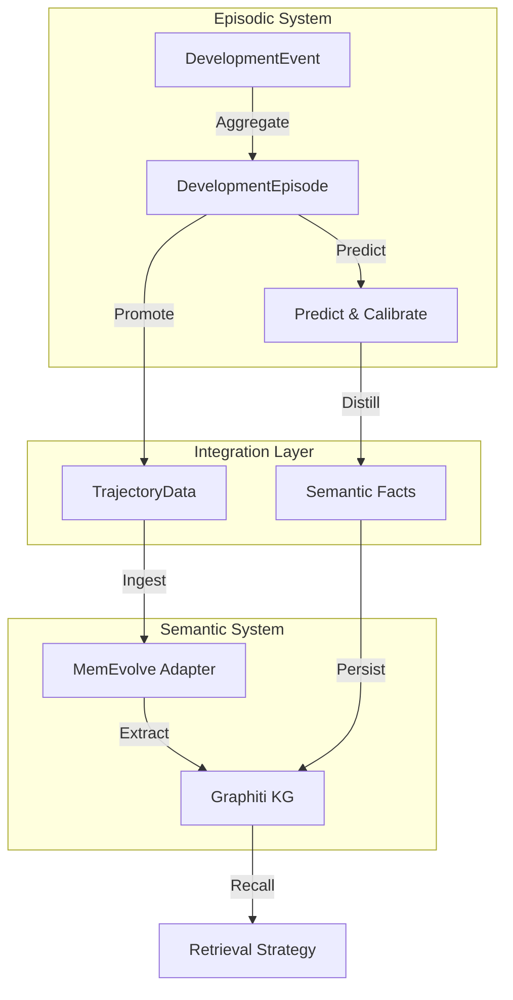

# Nemori Bridge: Unifying Episodic & Semantic Memory

**Feature**: 041 (Nemori Integration)
**Status**: Implemented
**Date**: 2026-01-26

## Context

Dionysus 3.0 evolved with two distinct memory systems:
1.  **Nemori (The River)**: A hierarchical, stream-based episodic memory system using `DevelopmentEvent` and `DevelopmentEpisode` (Source -> Tributary -> Main River).
2.  **MemEvolve (The Graph)**: A vector-backed knowledge graph system (Graphiti) using `TrajectoryData`, `Entity`, and `Fact` nodes for semantic retrieval.

A gap existed: **Narrative episodes generated in Nemori were not accessible to the semantic retrieval system.** We had a rich story but poor recall of that story during technical tasks.

## The Solution: Nemori Bridge

The **Nemori Bridge** (T041-029) is an architectural pattern that mechanically links these two systems without tightly coupling their internal logic. It operates at two key stages of the cognitive cycle.

### 1. Episodic Promotion (The Narrative Bridge)

When a `DevelopmentEpisode` is constructed (a "Tributary"), it is immediately promoted to the MemEvolve system as a `Trajectory`.

-   **Trigger**: `NemoriRiverFlow.construct_episode()`
-   **Transformation**:
    -   `Episode.title` -> `Trajectory.query`
    -   `Episode.summary` -> `Trajectory.observation`
    -   `Episode.narrative` -> `Trajectory.thought`
    -   `Episode.archetype` -> `Trajectory.action`
-   **Destination**: `MemEvolveAdapter.ingest_trajectory()`
-   **Outcome**: The episode narrative becomes vector-searchable and undergoes entity extraction (generating `MENTIONED_IN` links in the graph).

### 2. Semantic Distillation (The Fact Bridge)

During the `predict_and_calibrate` cycle (active inference), the system distills raw events into standalone semantic facts. These are now persisted directly to the Temporal Knowledge Graph.

-   **Trigger**: `NemoriRiverFlow.predict_and_calibrate()`
-   **Mechanism**:
    1.  **Basin Classification**: The memory is classified (Episodic/Semantic/Procedural) and routed to an Attractor Basin (e.g., `hexis_consent`).
    2.  **Fact Persistence**: Each verified fact is stored via `GraphitiService.persist_fact()`.
-   **Outcome**: Creates `Fact` nodes with:
    -   `valid_at`: Bi-temporal tracking.
    -   `DISTILLED_FROM`: Link to the source Episode.
    -   `confidence`: Score based on prediction error.

## Architecture Diagram



## Standard Compatibility

All future high-level narrative units (Concept Shifts, Project Milestones) **MUST** be bridged to the Knowledge Graph.

-   **Do not** store isolated JSON logs.
-   **Do** use `NemoriRiverFlow` methods which handle this bridging automatically.
-   **Do** ensure `GraphitiService` is healthy (`/health`) before heavy narrative processing.

## Implementation Details

The bridge is implemented in `api/services/nemori_river_flow.py`.

```python
# Episode Promotion
adapter = get_memevolve_adapter()
await adapter.ingest_trajectory(...)

# Fact Persistence
graphiti = await get_graphiti_service()
await graphiti.persist_fact(...)
```

This ensures that "The Map (Graph)" always updates to reflect "The Territory (River)".
