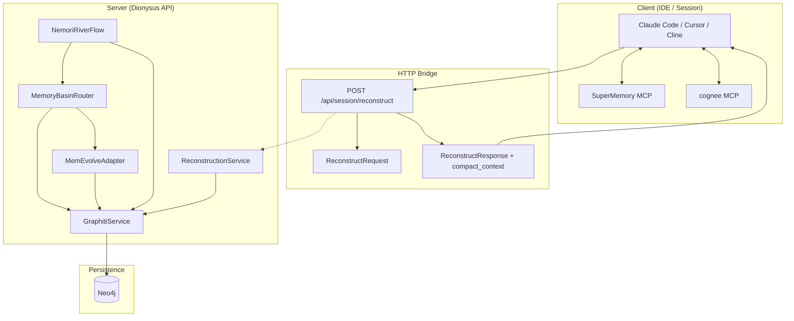

# Memory Layers: Client vs Server — Implementation and Data-Passing

**Status**: Documented (Transparency 10 / Depth 8.5)  
**Date**: 2026-01-27  
**Context**: Required Memory Setup (SuperMemory + cognee) and how it fits with MemEvolve, Graphiti, Nemori.

---

## 0. Executive Summary

Dionysus uses **two complementary memory layers**:

- **Server (Dionysus API):** MemEvolve, Graphiti, Nemori — trajectories, episodes, temporal facts, basin routing. Persistence: Neo4j via Graphiti, n8n webhooks.
- **Client (IDE/session):** SuperMemory MCP + cognee MCP — persistent session memory and knowledge-graph RAG. Persistence: MCP tool backends.

The **data-passing bridge** client → server is `POST /api/session/reconstruct`: client sends `project_path`, `device_id`, `cues`; receives `compact_context` and episodic memories. Client MCP handles editor/session context; server stack remains source of truth for engine state.

The rest of this entry gives **implementation-level detail**: file:line refs, exact Cypher, Pydantic field lists, env vars, config keys, wire formats, and error-handling paths.

---

## 1. Server Stack — Implementation Transparency

### 1.1 MemoryBasinRouter

**File:** `api/services/memory_basin_router.py`

**Public entry:** `async def route_memory(self, content: str, memory_type: Optional[MemoryType] = None, source_id: Optional[str] = None) -> Dict[str, Any]` (lines 178–220).

**Call chain:**

1. **Classification** (lines 195–200): If `memory_type is None`, calls `await self.classify_memory_type(content)`. Else uses `BASIN_MAPPING[memory_type]` (lines 33–60): `EPISODIC` → `experiential-basin`, `SEMANTIC` → `conceptual-basin`, `PROCEDURAL` → `procedural-basin`, `STRATEGIC` → `strategic-basin`.
2. **Basin activation** (lines 204–205): `basin_context = await self._activate_basin(basin_name, content)`.
3. **Ingestion** (lines 207–214): `result = await self._ingest_with_basin_context(content=content, basin_name=..., basin_context=..., memory_type=..., source_id=...)`.
4. **Return** (lines 216–220): `{"memory_type", "basin_name", "basin_context", "ingestion_result"}`.

**_activate_basin** (lines 222–312):

- **Cypher (lines 248–277):**  
  `MERGE (b:AttractorBasin {name: $name})`  
  `ON CREATE SET b.description, b.concepts, b.strength, b.stability=0.5, b.activation_count=1, b.importance=0.5, b.created_at=datetime()`  
  `ON MATCH SET b.strength += 0.05 (capped 2.0), b.stability += 0.02 (capped 1.0), b.importance += 0.03 (capped 1.0), b.activation_count += 1, b.last_activated=datetime()`  
  `RETURN b.name, b.strength, b.stability, b.concepts, b.description`.
- **Execution:** `memevolve = await self._get_memevolve_adapter()`; `rows = await memevolve.execute_cypher(create_cypher, params)` (line 289). Params: `name`, `description`, `concepts`, `strength` from `BASIN_MAPPING`.
- **Hebbian decay** (lines 295–296): `await self._apply_decay_to_other_basins(basin_name)`.
- **Decay Cypher** (lines 325–337): `MATCH (b:AttractorBasin) WHERE b.name <> $active_name` → `SET b.strength = max(b.strength - 0.01, 0.1)`, `b.importance = max(b.importance - 0.01, 0.1)`; executed via `memevolve.execute_cypher(decay_cypher, {"active_name", "decay"})` (lines 342–345).
- **Fallback:** On exception (lines 300–312), returns `_format_basin_context({name, description, concepts, strength}, extraction_focus)`.

**_ingest_with_basin_context** (lines 370–416+):

- Calls `memevolve = await self._get_memevolve_adapter()`.
- `extraction = await memevolve.extract_with_context(content=..., basin_context=..., strategy_context=f"Memory Type: {memory_type.value.upper()}", confidence_threshold=0.6)` (lines 393–399).
- Optional narrative enrichment: `narrative_service.extract_relationships(content)`; results merged into `extraction["relationships"]` (lines 403–413).
- `await self._record_basin_memory(basin_name, memory_type, extraction)` (line 416).
- Ingest of approved relationships (downstream) → Graphiti.

**Data:** `MemoryType` enum (episodic, semantic, procedural, strategic). `BASIN_MAPPING` values include `basin_name`, `description`, `concepts`, `default_strength`, `extraction_focus`.

---

### 1.2 MemEvolveAdapter

**File:** `api/services/memevolve_adapter.py`

**execute_cypher** (lines 518–527): Forwards to Graphiti. `graphiti = await self._get_graphiti_service()`; `return await graphiti.execute_cypher(statement, combined_params)`. No n8n Cypher path here; Neo4j access is via Graphiti.

**ingest_trajectory** (lines 67–240+):

- **Input:** `request: MemoryIngestRequest` — see §1.6 for full shape.
- **Env:** `webhook_enabled = os.getenv("MEMEVOLVE_WEBHOOK_INGEST_ENABLED", "false").lower() == "true"` (line 79).
- **Graphiti:** `graphiti = await self._get_graphiti_service()`; `trajectory_text = graphiti._format_trajectory_text(request.trajectory, max_chars=8000)`; `summary = request.trajectory.summary or await graphiti._summarize_trajectory(trajectory_text)` (lines 85–87).
- **Extraction branch:** If `request.entities` or `request.edges` provided, use them as `structured = {summary, entities, relationships}`. Else `extraction = await graphiti.extract_with_context(content=trajectory_text, confidence_threshold=0.6)`; `structured = {summary, entities: extraction["entities"], relationships: extraction["relationships"]}` (lines 88–102). On exception, fallback `structured = {summary: request.trajectory.summary or "Trajectory summary unavailable.", entities: [], relationships: []}` (lines 104–110).
- **Metadata:** `metadata = request.trajectory.metadata.model_dump(exclude_none=True)`; `session_id = request.session_id or metadata.get("session_id")`; `project_id = request.project_id or metadata.get("project_id")`; `trajectory_type = metadata.get("trajectory_type", TrajectoryType.EPISODIC)` (lines 112–129).
- **Neo4j CREATE (lines 167–212):**  
  `CREATE (t:Trajectory { id: $id, summary: $summary, query: $query, result: $result, trajectory_type: $trajectory_type, created_at: datetime(), occurred_at: $occurred_at, processed_at: null, agent_id: $agent_id, session_id: $session_id, project_id: $project_id, success: $success, reward: $reward, cost: $cost, latency_ms: $latency_ms, step_count: $step_count, metadata: $metadata, trajectory_json: $trajectory_json, trajectory_preview: $trajectory_preview })`  
  Params include `id` (uuid4), `summary`, `query`/`result` from `request.trajectory`, `trajectory_type`, `occurred_at` from `_resolve_valid_at(metadata)`, `session_id`, `project_id`, `metadata` keys, `trajectory_json` (steps as JSON), `trajectory_preview` (formatted text cap 2000 chars).
- **Relationship normalization** (lines 218–231): Each `rel` in `structured["relationships"]` → `{source, target, relation_type, evidence, confidence, status}`; `status = "approved"` if `confidence >= 0.6` else `"pending_review"`. Pending ones sent to `_record_pending_relationships` (graphiti, relationships, source_id, session_id, project_id).
- **Webhook:** If `webhook_enabled`, a payload is sent to n8n (operation `memevolve_ingest`, ingest_id, summary, entities, relationships, metadata, trajectory_type); implementation lives later in the same adapter.

**extract_with_context** (lines 529–544): Thin wrapper; calls `graphiti.extract_with_context(content=..., basin_context=..., strategy_context=..., confidence_threshold=...)`.

---

### 1.3 GraphitiService

**File:** `api/services/graphiti_service.py`

**extract_with_context** (lines 519–606):

- **Signature:** `async def extract_with_context(self, content: str, basin_context: Optional[str] = None, strategy_context: Optional[str] = None, confidence_threshold: float = 0.6, model: str = None) -> dict[str, Any]`.
- **LLM:** Uses `api.services.llm_service.chat_completion` with `model or GPT5_NANO`, `max_tokens=2048`. Prompt (lines 551–570): instructs JSON-only output `{"entities": ["concept1", ...], "relationships": [{"source","target","type","confidence","evidence"}]}`; relationship types include EXTENDS, VALIDATES, CONTRADICTS, REPLACES, CAUSES, ENABLES; confidence 0.0–1.0. Context sections: `CONTEXT FROM ATTRACTOR BASINS:\n{basin_context}` and `{strategy_context}` when provided.
- **Parsing:** `parsed = self._parse_json_response(response)`; `entities = parsed.get("entities", [])`; `relationships, approved_count, pending_count = self._normalize_relationships_with_confidence(raw_relationships, confidence_threshold)` (lines 581–586).
- **Return:** `{entities, relationships, approved_count, pending_count, confidence_threshold, model_used}`. On exception: `{entities: [], relationships: [], approved_count: 0, pending_count: 0, error: str(e)}` (lines 597–606).
- **Content cap:** `content[:4000]` in the prompt (line 556).

**persist_fact** (lines 782–857):

- **Signature:** `async def persist_fact(self, fact_text: str, source_episode_id: str, valid_at: datetime, basin_id: Optional[str] = None, confidence: float = 1.0, group_id: Optional[str] = None) -> Optional[str]`.
- **Idempotency:** `fact_id = f"fact_{hashlib.sha256(fact_text.encode()).hexdigest()[:16]}"` (lines 820–821).
- **Cypher (lines 824–844):**  
  `MERGE (f:Fact {id: $fact_id})`  
  `ON CREATE SET f.text = $fact_text, f.source_episode_id = $source_episode_id, f.basin_id = $basin_id, f.confidence = $confidence, f.valid_at = datetime($valid_at), f.created_at = datetime(), f.group_id = $group_id`  
  `ON MATCH SET f.confidence = CASE WHEN $confidence > f.confidence THEN $confidence ELSE f.confidence END`  
  `WITH f OPTIONAL MATCH (ep:Episode {id: $source_episode_id}) FOREACH (_ IN CASE WHEN ep IS NOT NULL THEN [1] ELSE [] END | MERGE (f)-[:DISTILLED_FROM]->(ep)) RETURN f.id as fact_id`
- **Params:** `fact_id`, `fact_text`, `source_episode_id`, `basin_id`, `confidence`, `valid_at.isoformat()`, `group_id or self.config.group_id`. Executed via `await self.execute_cypher(cypher, {...})` (lines 846–855).
- **Return:** `fact_id` from first row, or None.

**ingest_extracted_relationships** (lines 608+): Filters `relationships` for `r.get("status") == "approved"`; then uses Cypher to create/merge nodes and relationships (source, target, relation_type, evidence, etc.). Called by MemEvolveAdapter and by MemoryBasinRouter’s ingest path.

**search** (used by reconstruction): Contract `search(query=..., limit=..., group_ids=...)`; returns dict with `"edges"` (list of dicts with e.g. `fact`, `name`, `uuid`, `valid_at`). Reconstruction uses `results = await graphiti.search(query=query, limit=self.config.MAX_EPISODIC)` and `results.get("edges", [])` (reconstruction_service lines 374–377).

---

### 1.4 NemoriRiverFlow

**File:** `api/services/nemori_river_flow.py`

**construct_episode** (lines 228–326):

- **Signature:** `async def construct_episode(self, events: List[DevelopmentEvent], journey_id: str, parent_episode_id: Optional[str] = None) -> Optional[DevelopmentEpisode]`.
- **Episode build:** Builds `DevelopmentEpisode` from events (title, summary, narrative, start_time, end_time, events, dominant_archetype, river_stage, etc.). Exact logic is in the first half of the method.
- **Bridge to MemEvolve (lines 279–321):** After episode is built, builds `TrajectoryData`:
  - `query=episode.title`
  - `result=episode.summary`
  - `steps=[TrajectoryStep(observation=f"Summary: {episode.summary}", thought=f"Narrative: {episode.narrative}", action=f"Archetype: {episode.dominant_archetype...}, Strand: {episode.strand_id}")]`
  - `metadata=TrajectoryMetadata(agent_id="nemori_architect", session_id=None, project_id="dionysus_core", timestamp=episode.start_time, tags=["episode", episode.strand_id, "nemori"])`
- **Call:** `await adapter.ingest_trajectory(MemoryIngestRequest(trajectory=traj_data, session_id=None, project_id="dionysus_core", memory_type="episodic"))` (lines 315–321). Exception is logged and swallowed; episode is still returned.

**predict_and_calibrate** (lines 342–460+):

- **Signature:** `async def predict_and_calibrate(self, episode: DevelopmentEpisode, original_events: List[DevelopmentEvent], basin_context: Optional[Dict[str, Any]] = None) -> Tuple[List[str], Dict[str, Any]]`.
- **Predict:** LLM prompt asks for bulleted “predictions” (semantic facts / lessons) given episode title/summary and optional basin context (lines 358–364).
- **Calibrate:** LLM prompt asks for JSON only: `{"new_facts": ["fact1", ...], "symbolic_residue": {"active_goals": [], "active_entities": [], "stable_context": ""}, "surprisal": 0.5}` (lines 367–377). Response parsed with `json.loads(response.strip().strip("`").replace("json","").strip())`; `new_facts = data.get("new_facts", [])`, `residue = data.get("symbolic_residue", {})`, `surprisal = float(data.get("surprisal", 0.0))` (lines 386–392).
- **Meta-evolution:** If `surprisal > 0.6`, calls `await adapter.trigger_evolution()` (lines 396–399).
- **Fact routing (lines 416–458):** For each fact in `new_facts` with `len(fact) > 10`:
  - **4a.** `mem_type = await router.classify_memory_type(f"{episode.title}: {episode.summary}")`; `basin_config = router.get_basin_for_type(mem_type)`; `linked_basin_id = basin_config.get("basin_name")`.  
    `await router.route_memory(content=fact, memory_type=mem_type, source_id=f"nemori_distill:{episode.episode_id}")` (lines 437–441). Exceptions logged and skipped.
  - **4b.** `await graphiti.persist_fact(fact_text=fact, source_episode_id=episode.episode_id, valid_at=datetime.now(timezone.utc), basin_id=linked_basin_id, confidence=0.8)` (lines 449–456). Exceptions logged and skipped.
- **Return:** `(new_facts, symbolic_residue)` (plus downstream distill_event construction).

---

### 1.5 ReconstructionService (session-reconstruct)

**File:** `api/services/reconstruction_service.py`

**Constructor** (lines 253–266):

- `self.n8n_recall_url = n8n_recall_url or os.getenv("N8N_RECALL_URL", "http://n8n:5678/webhook/memory/v1/recall")`
- `self.graphiti_enabled = graphiti_enabled` (default False in constructor; can be overridden by factory).
- `self.config = ReconstructionConfig()` (see below).
- `self._driver = get_neo4j_driver()` — used for custom Neo4j in some code paths; primary retrieval uses Graphiti and n8n.

**ReconstructionConfig** (lines 35–58):

- Resonance weights: `CUE_RESONANCE_WEIGHT=0.5`, `CONTEXT_RESONANCE_WEIGHT=0.3`, `NETWORK_RESONANCE_WEIGHT=0.2`.
- Thresholds: `RESONANCE_ACTIVATION_THRESHOLD=0.3`, `HIGH_RESONANCE_THRESHOLD=0.5`, `COHERENCE_MIN=0.6`.
- Limits: `MAX_SESSIONS=10`, `MAX_TASKS=15`, `MAX_ENTITIES=20`, `MAX_EPISODIC=15`, `MAX_OUTPUT_TOKENS=4000`.
- Time: `RECENT_SESSION_HOURS=72`, `ACTIVE_TASK_DAYS=30`.

**reconstruct** (lines 272–334):

- **Input:** `context: ReconstructionContext`, `prefetched_tasks: Optional[list[dict]]`.
- **Steps:**  
  1. `await self._scan_fragments(context, prefetched_tasks)` → populates `self._fragments`.  
  2. `self._activate_resonance(context)` → sets `fragment.resonance_score` (cue×0.5 + context×0.3 + network×0.2), `fragment.activation = resonance_score` when ≥ 0.3.  
  3. `self._excite_fragments()` → multiplies activation by 1.3 for fragments with resonance ≥ 0.5.  
  4. `self._evolve_field()` → sort fragments by `activation * strength` descending.  
  5. `extracted = self._extract_patterns()` → buckets by `FragmentType` into `sessions`, `tasks`, `entities`, `decisions`, `episodic`.  
  6. `gap_fills = self._identify_and_fill_gaps(extracted, context)` (MVP returns `[]`).  
  7. `coherence_score = self._validate_coherence(extracted)` (MVP returns `0.8`).  
  8. Build `ReconstructedMemory(...)` and return.

**_scan_fragments** (lines 341–362):

- Clears `self._fragments`.
- `await self._scan_episodic_memories(context)` → Graphiti.
- `await self._scan_sessions(context)` → n8n.
- If `prefetched_tasks is not None`, `_load_prefetched_tasks(prefetched_tasks)`.
- If `self.graphiti_enabled`, `await self._scan_entities(context)`.

**_scan_episodic_memories** (lines 364–393):

- `query = " ".join([context.project_name] + context.cues)`; `graphiti = await get_graphiti_service()`; `results = await graphiti.search(query=query, limit=self.config.MAX_EPISODIC)` (lines 368–375).
- For each `edge` in `results.get("edges", [])`: build `Fragment(fragment_id=edge.uuid, fragment_type=EPISODIC, content=edge.fact or edge.name, summary=edge.fact, strength=position_score, source="graphiti", metadata=edge)` and append. `position_score = 1.0 - (idx/len(edges))*0.5` (lines 377–391).
- On exception: log and no-op.

**_scan_sessions** (lines 395–424):

- `cutoff = now - timedelta(hours=72)`.  
- **n8n payload:** `{"operation": "query", "filters": {"project_id": context.project_id, "from_date": cutoff.isoformat()}, "limit": 10}`.  
- **HTTP:** `POST self.n8n_recall_url` (default `http://n8n:5678/webhook/memory/v1/recall`), `timeout=10.0`.  
- **Response:** `result = response.json()`; `sessions = result.get("sessions", result.get("memories", []))`. For each: `Fragment(..., fragment_type=SESSION, content=session.summary|content, source="n8n", ...)`. On exception: log and no-op.

**_extract_patterns** (lines 502–514):

- Iterates `self._fragments` with `fragment.activation >= RESONANCE_ACTIVATION_THRESHOLD`. Appends to `extracted["sessions"]`, `["tasks"]`, `["entities"]`, `["decisions"]`, `["episodic"]` with per-type dict shape (id, summary/title/name, date/status/feature/type, resonance, etc.).

**to_compact_context** (ReconstructedMemory, lines 145–220): Builds markdown with `# Session Context (Reconstructed)`, `## Project`, `## Recent Sessions` (up to 3), `## Active Tasks` (up to 5), `## Key Entities` (up to 5), `## Recent Decisions`, `## Episodic Memories` (up to 5). Used as `compact_context` in API response.

---

### 1.6 Server-Side Data Shapes (Exact Fields)

**TrajectoryStep** (`api/models/memevolve.py` lines 41–47): `observation: Optional[str]`, `thought: Optional[str]`, `action: Optional[str]`, `model_config = ConfigDict(extra="allow")`.

**TrajectoryMetadata** (lines 50–65): `agent_id`, `session_id`, `project_id`, `trajectory_type: TrajectoryType`, `success`, `reward`, `cost`, `latency_ms`, `model_id`, `timestamp`, `tags: List[str]`, `extra="allow"`.

**TrajectoryData** (lines 68–94): `id`, `query`, `trajectory` (raw list), `steps: List[TrajectoryStep]`, `result`, `metadata: Optional[TrajectoryMetadata]`, `summary`, `extra="allow"`.

**MemoryIngestRequest** (lines 96–125): `trajectory: TrajectoryData`, `entities: Optional[List[Dict]]`, `edges: Optional[List[Dict]]` (alias `relationships`), `session_id`, `project_id`, `memory_type: Optional[str]`, `extra="allow"`.

**ReconstructionContext** (reconstruction_service lines 101–121): `project_path: str`, `project_name: str`, `device_id: Optional[str]`, `session_id: Optional[str]`, `cues: list[str]`, `project_id: Optional[str]` (from `hashlib.sha256(project_path.encode()).hexdigest()[:32]` in `__post_init__`).

**ReconstructRequest** (`api/routers/session.py` lines 36–66): `project_path: str`, `project_name: Optional[str]`, `device_id: Optional[str]`, `session_id: Optional[str]`, `cues: list[str]`, `prefetched_tasks: Optional[list[dict]]`.

**ReconstructResponse** (lines 70–108): `success=True`, `project_summary`, `recent_sessions`, `active_tasks`, `key_entities`, `recent_decisions`, `episodic_memories`, `coherence_score`, `fragment_count`, `reconstruction_time_ms`, `gap_fills`, `warnings`, **`compact_context: str`**.

**Fragment** (reconstruction_service lines 74–98): `fragment_id`, `fragment_type: FragmentType`, `content`, `summary`, `strength=0.5`, `activation=0.0`, `resonance_score=0.0`, `created_at`, `last_accessed`, `access_count`, `connections`, `source`, `metadata`.

---

## 2. Client Stack — Implementation Transparency

### 2.1 setup.sh (Repo Root)

**File:** `setup.sh`

- **set -e** (line 3): Script exits on first failing command.
- **SuperMemory MCP** (lines 5–7): `npx -y install-mcp@latest https://mcp.supermemory.ai/mcp --client vscode --oauth=yes`.
- **Cognee** (lines 9–11): `pip3 install cognee`.
- **Claude Code CLI** (lines 13–37):  
  - `CLAUDE_CONFIG="$HOME/.claude/settings.json"`.  
  - If file exists and `command -v jq` succeeds: `jq '.mcpServers.cognee = {"command": "python3", "args": ["-m", "cognee.mcp"]}' "$CLAUDE_CONFIG" > "$CLAUDE_CONFIG.tmp" && mv "$CLAUDE_CONFIG.tmp" "$CLAUDE_CONFIG"`; echo "Updated existing Claude Code config."  
  - Else if no jq: echo "Warning: jq not installed. Please manually add cognee to $CLAUDE_CONFIG".  
  - Else: `mkdir -p "$(dirname "$CLAUDE_CONFIG")"`; write new JSON `{"mcpServers": {"cognee": {"command": "python3", "args": ["-m", "cognee.mcp"]}}}`; echo "Created new Claude Code config."
- **Cline/Cursor** (lines 39–62):  
  - macOS: `CLINE_CONFIG="$HOME/Library/Application Support/Code/User/globalStorage/saoudrizwan.claude-dev/settings/cline_mcp_settings.json"`.  
  - Non-macOS: `CLINE_CONFIG="$HOME/.config/Code/User/globalStorage/saoudrizwan.claude-dev/settings/cline_mcp_settings.json"`.  
  - If file exists and jq available: merge cognee into `.mcpServers.cognee` via jq; echo "Updated existing Cline/Cursor config."  
  - Else: create new file with same `mcpServers.cognee` object; echo "Created new Cline/Cursor config."
- **Final message** (line 59): "Setup complete. Restart Claude Code and Cursor."

No env vars read inside setup.sh; paths are fixed as above. Cognee MCP is always `python3 -m cognee.mcp`.

### 2.2 Client → Server Wire (session-reconstruct)

**Request:** `POST /api/session/reconstruct` (router prefix `/api/session`, so full path `/api/session/reconstruct`).  
**Body (JSON):** `ReconstructRequest`: `project_path` (required), `project_name`, `device_id`, `session_id`, `cues`, `prefetched_tasks`.  
**Response:** `ReconstructResponse` with `compact_context` (markdown string) and numeric/array fields above. Client or a hook injects `compact_context` into the IDE session.

---

## 3. Environment and Config Reference

| Env / config | Where used | Default / meaning |
|--------------|------------|-------------------|
| `N8N_RECALL_URL` | ReconstructionService, remote_sync | `http://n8n:5678/webhook/memory/v1/recall` |
| `MEMEVOLVE_WEBHOOK_INGEST_ENABLED` | MemEvolveAdapter.ingest_trajectory | `"false"` → no webhook |
| `MEMEVOLVE_EVOLVE_BACKEND` | MemEvolveAdapter.trigger_evolution | `"graphiti"` → use Graphiti; else n8n evolve webhook |
| ReconstructionConfig | ReconstructionService | CUE/CONTEXT/NETWORK weights, thresholds, MAX_* limits, RECENT_SESSION_HOURS=72 |

---

## 4. Data-Passing Summary (Layer by Layer)

1. **Client → Server (retrieval):** HTTP `POST /api/session/reconstruct` with `ReconstructRequest` → `ReconstructionService.reconstruct` → `_scan_fragments` (Graphiti.search for episodic, n8n POST for sessions, prefetched tasks, optional Graphiti entities) → resonance → excite → evolve → extract → `ReconstructedMemory.to_compact_context()` → `ReconstructResponse.compact_context`.
2. **Server ingest (content → graph):** Caller → `MemoryBasinRouter.route_memory(content, ...)` → classify → `_activate_basin` (MemEvolveAdapter.execute_cypher = Graphiti.execute_cypher) → `_ingest_with_basin_context` → MemEvolveAdapter.extract_with_context → GraphitiService.extract_with_context (LLM, parse JSON, normalize) → ingest_relationships / Trajectory CREATE + relationship writes via Graphiti.
3. **Nemori → graph:** `construct_episode` builds episode then `MemEvolveAdapter.ingest_trajectory(MemoryIngestRequest(trajectory=TrajectoryData(...), ...))`. `predict_and_calibrate` produces `new_facts` → per-fact `router.route_memory(...)` and `graphiti.persist_fact(...)`.
4. **Client-only:** IDE ↔ SuperMemory MCP and cognee MCP via MCP protocol; no direct MemEvolve/Graphiti/Nemori calls.

---

## 5. Architecture Diagram

---

## 6. Do’s and Don’ts

**Do:** Use server stack for engine state; use client stack (SuperMemory + cognee) for IDE/session context; run `./setup.sh`; call `POST /api/session/reconstruct` and inject `compact_context`; send raw trajectories (no pre-digested entities/edges unless API allows); document inlet/outlet for new memory features.

**Don’t:** Bypass MemoryBasinRouter → MemEvolve → Graphiti for engine content; duplicate server logic in client MCP; replace MemEvolve/Graphiti/Nemori with cognee/SuperMemory for engine state; connect client MCP backends to project Neo4j.

---

## 7. References

- **Server flow:** `.conductor/constraints.md` — Memory Stack Integration Pattern.
- **Nemori ↔ MemEvolve:** `docs/journal/2026-01-26-nemori-bridge-architecture.md`.
- **Session-reconstruct:** `api/routers/session.py`, `api/services/reconstruction_service.py`.
- **Required Memory Setup:** `README.md` § Required Memory Setup, `setup.sh`, `AGENTS.md` § Required Memory Setup (SuperMemory + Cognee).
