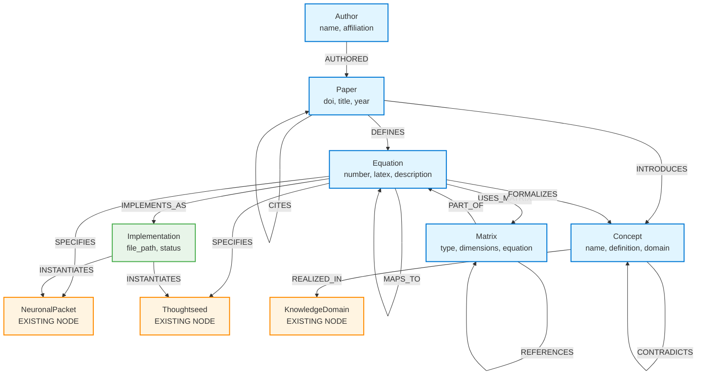

# Neo4j Graph Schema: Academic Papers & Technical Content

**Purpose**: Store academic papers and their technical content for Thoughtseeds implementation
**Integration**: Connects with existing Thoughtseeds nodes (NeuronalPacket, Thoughtseed, KnowledgeDomain)
**Version**: 1.0
**Date**: 2026-01-03
**Author**: Dr. Mani Saint-Victor

---

## Overview

This schema enables systematic extraction and cross-referencing of academic knowledge for implementing the Thoughtseeds framework. It captures papers, equations, concepts, and their relationships while integrating with the existing cognitive architecture.

**Key Features**:
- Paper metadata and citation tracking
- Mathematical equation extraction and mapping
- Concept definitions and relationships
- Implementation traceability
- POMDP matrix specifications
- Cross-paper equation mapping

---

## Graph Schema Diagram



---

## Node Types & Properties

### 1. Paper

Academic paper metadata and content references.

```cypher
// Node Label: Paper
{
  id: "paper-kavi-2025",                  // Unique identifier
  doi: "10.xxxx/xxxx",                    // DOI
  citation_key: "kavi_et_al_2025",        // BibTeX key
  title: "From Neuronal Packets to Thoughtseeds",
  abstract: "Full abstract text...",
  year: 2025,
  journal: "Cognitive Science",
  volume: "49",
  pages: "1-42",
  pdf_path: "/papers/kavi_2025.pdf",      // Local storage path
  extraction_status: "complete",          // complete | partial | pending
  created_at: datetime(),
  updated_at: datetime(),

  // Metadata
  arxiv_id: "2501.xxxxx",                 // Optional
  pubmed_id: "12345678",                  // Optional
  keywords: ["active inference", "consciousness", "thoughtseeds"],

  // Extraction tracking
  total_equations: 17,
  extracted_equations: 17,
  total_concepts: 42,
  extracted_concepts: 42
}
```

**Constraints**:
```cypher
CREATE CONSTRAINT paper_id_unique IF NOT EXISTS
FOR (p:Paper) REQUIRE p.id IS UNIQUE;

CREATE CONSTRAINT paper_doi_unique IF NOT EXISTS
FOR (p:Paper) REQUIRE p.doi IS UNIQUE;

CREATE INDEX paper_year_idx IF NOT EXISTS
FOR (p:Paper) ON (p.year);

CREATE INDEX paper_citation_key_idx IF NOT EXISTS
FOR (p:Paper) ON (p.citation_key);
```

---

### 2. Equation

Mathematical equations extracted from papers with context.

```cypher
// Node Label: Equation
{
  id: "eq-kavi-2025-1",                   // Unique identifier
  paper_id: "paper-kavi-2025",            // Reference to source paper
  number: "1",                            // Equation number in paper
  section: "3.1",                         // Section where defined

  // Content
  latex: "NP_i = {A_i^{core}, A_i^{sub}, \\alpha_i^{core}, \\alpha_i^{sub}, K_i, S_i}",
  description: "Neuronal Packet state representation",
  explanation: "Defines the complete state of a neuronal packet including core and subordinate attractors",

  // Variables
  variables: [
    {symbol: "A_i^{core}", meaning: "Core attractor", type: "state"},
    {symbol: "A_i^{sub}", meaning: "Subordinate attractors", type: "state_set"},
    {symbol: "\\alpha_i^{core}", meaning: "Core activation level", type: "scalar", range: "[0,1]"},
    {symbol: "K_i", meaning: "Encapsulated knowledge", type: "knowledge_structure"},
    {symbol: "S_i", meaning: "NP state", type: "enum", values: "{0,1,2}"}
  ],

  // Classification
  equation_type: "state_representation",  // state_representation | free_energy | generative_model | etc.
  domain: "cognitive_science",
  importance: "foundational",             // foundational | supporting | derived

  // Implementation
  implementation_status: "planned",       // planned | in_progress | implemented | verified
  implementation_priority: "P1",

  created_at: datetime(),
  updated_at: datetime()
}
```

**Constraints**:
```cypher
CREATE CONSTRAINT equation_id_unique IF NOT EXISTS
FOR (eq:Equation) REQUIRE eq.id IS UNIQUE;

CREATE INDEX equation_paper_idx IF NOT EXISTS
FOR (eq:Equation) ON (eq.paper_id);

CREATE INDEX equation_type_idx IF NOT EXISTS
FOR (eq:Equation) ON (eq.equation_type);

CREATE INDEX equation_status_idx IF NOT EXISTS
FOR (eq:Equation) ON (eq.implementation_status);
```

---

### 3. Concept

Cognitive/computational concepts introduced or used in papers.

```cypher
// Node Label: Concept
{
  id: "concept-markov-blanket",           // Unique identifier
  name: "Markov Blanket",

  // Definition
  definition: "A statistical boundary separating internal states from external states via sensory and active surfaces",
  formal_definition: "Given partition (η, s, a, μ), blanket b = s ∪ a such that μ ⊥ η | b",

  // Classification
  domain: "active_inference",             // active_inference | neuroscience | machine_learning | etc.
  subdomain: "statistical_mechanics",
  importance: "core",                     // core | supporting | peripheral

  // Relationships
  synonyms: ["statistical boundary", "Markov boundary"],
  related_concepts: ["free_energy_principle", "active_inference", "predictive_coding"],

  // Paper provenance
  introduced_in: "paper-friston-2010",
  cited_count: 15,                        // Number of papers citing this

  // Implementation
  implementation_status: "implemented",    // implemented | partial | not_implemented
  implementation_notes: "See api/models/markov_blanket.py",

  created_at: datetime(),
  updated_at: datetime()
}
```

**Constraints**:
```cypher
CREATE CONSTRAINT concept_id_unique IF NOT EXISTS
FOR (c:Concept) REQUIRE c.id IS UNIQUE;

CREATE INDEX concept_name_idx IF NOT EXISTS
FOR (c:Concept) ON (c.name);

CREATE INDEX concept_domain_idx IF NOT EXISTS
FOR (c:Concept) ON (c.domain);

CREATE FULLTEXT INDEX concept_definition_fulltext IF NOT EXISTS
FOR (c:Concept) ON EACH [c.definition, c.formal_definition];
```

---

### 4. Implementation

Code implementation references linking equations to codebase.

```cypher
// Node Label: Implementation
{
  id: "impl-neuronal-packet-service",     // Unique identifier

  // File references
  file_path: "/api/services/neuronal_packet_service.py",
  class_name: "NeuronalPacketService",
  method_name: "calculate_free_energy",   // Optional
  line_start: 145,
  line_end: 203,

  // Implementation details
  language: "python",
  status: "implemented",                  // planned | in_progress | implemented | verified | deprecated
  spec_reference: "specs/061-neuronal-packets/spec.md",

  // Quality metrics
  test_coverage: 0.85,
  has_tests: true,
  test_file: "/tests/unit/test_neuronal_packet_service.py",

  // Documentation
  description: "Implements free energy calculation for neuronal packets using Eq 3",
  notes: "Uses async/await pattern for Neo4j queries",

  created_at: datetime(),
  updated_at: datetime(),
  last_verified: datetime()
}
```

**Constraints**:
```cypher
CREATE CONSTRAINT implementation_id_unique IF NOT EXISTS
FOR (i:Implementation) REQUIRE i.id IS UNIQUE;

CREATE INDEX implementation_file_idx IF NOT EXISTS
FOR (i:Implementation) ON (i.file_path);

CREATE INDEX implementation_status_idx IF NOT EXISTS
FOR (i:Implementation) ON (i.status);
```

---

### 5. Author

Paper authors with affiliations and contributions.

```cypher
// Node Label: Author
{
  id: "author-kavi-sridhar",              // Unique identifier
  name: "Sridhar Kavi",

  // Affiliation
  affiliation: "University of Example",
  department: "Department of Cognitive Science",
  email: "skavi@example.edu",             // Optional

  // Identity
  orcid: "0000-0000-0000-0000",          // Optional
  google_scholar_id: "abc123",            // Optional

  // Contribution tracking
  papers_authored: 5,
  first_author_papers: 2,
  last_author_papers: 1,

  // Research areas
  research_areas: ["active inference", "consciousness", "free energy principle"],

  created_at: datetime(),
  updated_at: datetime()
}
```

**Constraints**:
```cypher
CREATE CONSTRAINT author_id_unique IF NOT EXISTS
FOR (a:Author) REQUIRE a.id IS UNIQUE;

CREATE INDEX author_name_idx IF NOT EXISTS
FOR (a:Author) ON (a.name);

CREATE INDEX author_orcid_idx IF NOT EXISTS
FOR (a:Author) ON (a.orcid);
```

---

### 6. Matrix

POMDP matrices (A, B, C, D, E) used in active inference equations.

```cypher
// Node Label: Matrix
{
  id: "matrix-a-observation",             // Unique identifier

  // Matrix specification
  type: "A",                              // A | B | C | D | E
  name: "Observation Model",
  symbol: "A",

  // Dimensions
  dimensions: {
    rows: "observations",
    cols: "hidden_states",
    shape: "[O x S]"
  },

  // Mathematical definition
  latex: "A_{ij} = P(o_i | s_j)",
  meaning: "Probability of observation o_i given hidden state s_j",

  // Context
  description: "Maps hidden states to sensory observations",
  usage_context: "Perceptual inference, prediction errors",

  // Paper reference
  paper_id: "paper-friston-2010",
  equation_id: "eq-friston-2010-2",

  // Implementation
  implementation_notes: "Typically learned from experience or specified as prior",

  created_at: datetime(),
  updated_at: datetime()
}
```

**Matrix Types**:
- **A**: Observation model (likelihood mapping)
- **B**: Transition model (state dynamics)
- **C**: Preference model (desired observations)
- **D**: Prior beliefs (initial state distribution)
- **E**: Policy prior (action preferences)

**Constraints**:
```cypher
CREATE CONSTRAINT matrix_id_unique IF NOT EXISTS
FOR (m:Matrix) REQUIRE m.id IS UNIQUE;

CREATE INDEX matrix_type_idx IF NOT EXISTS
FOR (m:Matrix) ON (m.type);
```

---

## Relationships

### 1. Paper → Author

```cypher
// Relationship: AUTHORED
// Direction: Author -[:AUTHORED]-> Paper

(:Author {id: "author-kavi-sridhar"})
  -[:AUTHORED {
    author_position: 1,              // 1 = first author, -1 = last author
    contribution_type: "primary",    // primary | equal | corresponding
    order: 1                         // Author order in paper
  }]->
(:Paper {id: "paper-kavi-2025"})
```

---

### 2. Paper → Equation

```cypher
// Relationship: DEFINES
// Direction: Paper -[:DEFINES]-> Equation

(:Paper {id: "paper-kavi-2025"})
  -[:DEFINES {
    page_number: 8,
    section: "3.1",
    first_occurrence: true,          // First definition vs later reference
    context: "Foundational state representation"
  }]->
(:Equation {id: "eq-kavi-2025-1"})
```

---

### 3. Paper → Concept

```cypher
// Relationship: INTRODUCES
// Direction: Paper -[:INTRODUCES]-> Concept

(:Paper {id: "paper-kavi-2025"})
  -[:INTRODUCES {
    novelty: "original",             // original | refinement | application
    section: "2.1",
    page_number: 5,
    significance: "foundational"
  }]->
(:Concept {id: "concept-thoughtseed"})
```

---

### 4. Paper → Paper

```cypher
// Relationship: CITES
// Direction: Paper -[:CITES]-> Paper

(:Paper {id: "paper-kavi-2025"})
  -[:CITES {
    citation_context: "theoretical_foundation",
    citation_count: 3,               // Number of times cited in paper
    sections: ["2.1", "3.2", "5.1"]
  }]->
(:Paper {id: "paper-friston-2010"})
```

---

### 5. Equation → Equation

```cypher
// Relationship: MAPS_TO
// Direction: Equation -[:MAPS_TO]-> Equation
// Purpose: Cross-paper equation equivalence or correspondence

(:Equation {id: "eq-kavi-2025-3"})
  -[:MAPS_TO {
    mapping_type: "equivalent",      // equivalent | specialization | generalization | analogous
    transformation: "Substitutes K_i for knowledge structure in Friston's formulation",
    confidence: "high",              // high | medium | low
    verified_by: "manual_analysis"
  }]->
(:Equation {id: "eq-friston-2010-5"})
```

---

### 6. Equation → Implementation

```cypher
// Relationship: IMPLEMENTS_AS
// Direction: Equation -[:IMPLEMENTS_AS]-> Implementation

(:Equation {id: "eq-kavi-2025-3"})
  -[:IMPLEMENTS_AS {
    completeness: "partial",         // complete | partial | approximate
    deviations: "Uses discrete approximation instead of continuous integral",
    verification_status: "tested",
    test_results_path: "/tests/results/eq_3_verification.json"
  }]->
(:Implementation {id: "impl-neuronal-packet-service"})
```

---

### 7. Equation → Matrix

```cypher
// Relationship: USES_MATRIX
// Direction: Equation -[:USES_MATRIX]-> Matrix

(:Equation {id: "eq-friston-2010-efe"})
  -[:USES_MATRIX {
    role: "observation_likelihood",  // Role of matrix in equation
    required: true,                  // true if matrix must be specified
    learned: true                    // true if learned from data
  }]->
(:Matrix {id: "matrix-a-observation"})
```

---

### 8. Equation → Concept

```cypher
// Relationship: FORMALIZES
// Direction: Equation -[:FORMALIZES]-> Concept

(:Equation {id: "eq-friston-2010-3"})
  -[:FORMALIZES {
    aspect: "complete",              // complete | partial | specific_case
    variables_used: ["F", "s", "a", "μ"]
  }]->
(:Concept {id: "concept-free-energy-principle"})
```

---

### 9. Concept → Concept

```cypher
// Relationship: RELATED_TO
// Direction: Concept -[:RELATED_TO]-> Concept

(:Concept {id: "concept-thoughtseed"})
  -[:RELATED_TO {
    relationship_type: "composed_of",  // composed_of | enables | constrains | etc.
    strength: "strong",                // strong | moderate | weak
    description: "Thoughtseeds are composed of Knowledge Domains"
  }]->
(:Concept {id: "concept-knowledge-domain"})
```

```cypher
// Relationship: PREREQUISITE_FOR
// Direction: Concept -[:PREREQUISITE_FOR]-> Concept

(:Concept {id: "concept-markov-blanket"})
  -[:PREREQUISITE_FOR {
    necessity: "required",           // required | helpful | optional
    teaching_order: 1
  }]->
(:Concept {id: "concept-active-inference"})
```

```cypher
// Relationship: CONTRADICTS
// Direction: Concept -[:CONTRADICTS]-> Concept

(:Concept {id: "concept-symbolic-ai"})
  -[:CONTRADICTS {
    contradiction_type: "methodological",
    resolution: "Thoughtseeds propose subsymbolic grounding",
    paper_reference: "paper-kavi-2025"
  }]->
(:Concept {id: "concept-embodied-cognition"})
```

---

### 10. Matrix → Matrix

```cypher
// Relationship: REFERENCES
// Direction: Matrix -[:REFERENCES]-> Matrix

(:Matrix {id: "matrix-b-transition"})
  -[:REFERENCES {
    reference_type: "conditioning",   // conditioning | inverse | product
    description: "B matrix conditions on A for state prediction"
  }]->
(:Matrix {id: "matrix-a-observation"})
```

---

### 11. Integration with Thoughtseeds Nodes

```cypher
// Relationship: SPECIFIES
// Direction: Equation -[:SPECIFIES]-> NeuronalPacket

(:Equation {id: "eq-kavi-2025-1"})
  -[:SPECIFIES {
    component: "state_representation",
    specification_type: "structure",  // structure | dynamics | constraints
    implemented: false
  }]->
(:NeuronalPacket)  // Existing Thoughtseeds node
```

```cypher
// Relationship: REALIZED_IN
// Direction: Concept -[:REALIZED_IN]-> KnowledgeDomain

(:Concept {id: "concept-knowledge-domain"})
  -[:REALIZED_IN {
    realization_type: "instantiation",
    instance_id: "kd-visual-processing"
  }]->
(:KnowledgeDomain)  // Existing Thoughtseeds node
```

```cypher
// Relationship: INSTANTIATES
// Direction: Implementation -[:INSTANTIATES]-> Thoughtseed

(:Implementation {id: "impl-thoughtseed-service"})
  -[:INSTANTIATES {
    instance_type: "service_class",
    completeness: "partial"
  }]->
(:Thoughtseed)  // Existing Thoughtseeds node
```

---

## Example Queries

### Query 1: Find All Equations from a Paper

```cypher
// Find all equations defined in Kavi et al. 2025
MATCH (p:Paper {citation_key: "kavi_et_al_2025"})-[:DEFINES]->(eq:Equation)
RETURN p.title AS paper,
       eq.number AS eq_num,
       eq.latex AS equation,
       eq.description AS description,
       eq.implementation_status AS status
ORDER BY toInteger(eq.number);
```

**Expected Output**:
```
paper                              eq_num  equation                    description                    status
"From Neuronal Packets..."         "1"     "NP_i = {...}"             "NP state representation"      "planned"
"From Neuronal Packets..."         "2"     "P(s_i, a_i | ...)"        "NP generative model"          "planned"
"From Neuronal Packets..."         "3"     "F_i = D_KL[...] - ..."    "NP free energy"               "planned"
```

---

### Query 2: Cross-Paper Equation Mapping

```cypher
// Find equations that map across papers
MATCH (eq1:Equation)-[m:MAPS_TO]->(eq2:Equation)
MATCH (p1:Paper)-[:DEFINES]->(eq1)
MATCH (p2:Paper)-[:DEFINES]->(eq2)
RETURN p1.citation_key AS source_paper,
       eq1.number AS source_eq,
       m.mapping_type AS mapping,
       p2.citation_key AS target_paper,
       eq2.number AS target_eq,
       m.transformation AS how
ORDER BY p1.year DESC;
```

**Expected Output**:
```
source_paper      source_eq  mapping          target_paper      target_eq  how
"kavi_et_al_2025" "3"        "equivalent"     "friston_2010"    "5"        "Substitutes K_i for..."
"kavi_et_al_2025" "11"       "specialization" "friston_2010"    "12"       "Adds valence/arousal..."
```

---

### Query 3: Find Unimplemented Equations by Priority

```cypher
// Find high-priority equations not yet implemented
MATCH (eq:Equation)
WHERE eq.implementation_status IN ['planned', 'in_progress']
  AND eq.implementation_priority = 'P1'
MATCH (p:Paper)-[:DEFINES]->(eq)
OPTIONAL MATCH (eq)-[:FORMALIZES]->(c:Concept)
RETURN p.citation_key AS paper,
       eq.number AS eq_num,
       eq.description AS description,
       eq.implementation_priority AS priority,
       eq.implementation_status AS status,
       collect(c.name) AS concepts
ORDER BY eq.implementation_priority, eq.number;
```

**Expected Output**:
```
paper             eq_num  description             priority  status        concepts
"kavi_et_al_2025" "1"     "NP state..."           "P1"      "planned"     ["Neuronal Packet"]
"kavi_et_al_2025" "3"     "NP free energy"        "P1"      "in_progress" ["Free Energy", "NP"]
```

---

### Query 4: Concept Dependency Graph

```cypher
// Find prerequisite chain for a concept
MATCH path = (start:Concept {name: "Thoughtseed"})
             -[:PREREQUISITE_FOR*0..3]->
             (end:Concept)
RETURN start.name AS prerequisite,
       end.name AS concept,
       length(path) AS depth,
       [rel in relationships(path) | rel.necessity] AS necessity_chain
ORDER BY depth;
```

**Expected Output**:
```
prerequisite       concept             depth  necessity_chain
"Thoughtseed"      "Thoughtseed"       0      []
"Thoughtseed"      "Active Pool"       1      ["required"]
"Thoughtseed"      "Consciousness"     2      ["required", "required"]
```

---

### Query 5: Implementation Coverage by Paper

```cypher
// Calculate implementation coverage for each paper
MATCH (p:Paper)-[:DEFINES]->(eq:Equation)
WITH p,
     count(eq) AS total_equations,
     count(CASE WHEN eq.implementation_status = 'implemented' THEN 1 END) AS implemented,
     count(CASE WHEN eq.implementation_status = 'verified' THEN 1 END) AS verified
RETURN p.citation_key AS paper,
       p.year AS year,
       total_equations,
       implemented,
       verified,
       round(100.0 * implemented / total_equations, 1) AS pct_implemented,
       round(100.0 * verified / total_equations, 1) AS pct_verified
ORDER BY pct_implemented DESC, p.year DESC;
```

**Expected Output**:
```
paper             year  total  implemented  verified  pct_implemented  pct_verified
"friston_2010"    2010  8      8            6         100.0            75.0
"kavi_et_al_2025" 2025  17     3            0         17.6             0.0
```

---

### Query 6: Find Equations Using Specific Matrix Type

```cypher
// Find all equations using A matrix (observation model)
MATCH (eq:Equation)-[:USES_MATRIX]->(m:Matrix {type: 'A'})
MATCH (p:Paper)-[:DEFINES]->(eq)
RETURN p.citation_key AS paper,
       eq.number AS eq_num,
       eq.description AS equation,
       m.name AS matrix_name,
       m.meaning AS matrix_meaning
ORDER BY p.year, eq.number;
```

**Expected Output**:
```
paper          eq_num  equation               matrix_name          matrix_meaning
"friston_2010" "2"     "VFE calculation"      "Observation Model"  "P(o|s)"
"friston_2010" "8"     "EFE calculation"      "Observation Model"  "P(o|s)"
```

---

### Query 7: Papers Citing Foundational Work

```cypher
// Find citation network for Free Energy Principle
MATCH (cited:Paper {citation_key: "friston_2010"})
      <-[c:CITES]-(citing:Paper)
RETURN citing.citation_key AS citing_paper,
       citing.year AS year,
       c.citation_context AS context,
       c.citation_count AS times_cited
ORDER BY citing.year DESC;
```

---

### Query 8: Integration Points with Thoughtseeds

```cypher
// Find which equations specify existing Thoughtseeds components
MATCH (eq:Equation)-[s:SPECIFIES]->(ts)
WHERE ts:NeuronalPacket OR ts:Thoughtseed OR ts:KnowledgeDomain
MATCH (p:Paper)-[:DEFINES]->(eq)
RETURN p.citation_key AS paper,
       eq.number AS eq_num,
       eq.description AS equation,
       labels(ts)[0] AS component,
       s.component AS specifies_what,
       s.implemented AS is_implemented
ORDER BY is_implemented, labels(ts)[0];
```

**Expected Output**:
```
paper             eq_num  equation           component         specifies_what         is_implemented
"kavi_et_al_2025" "1"     "NP state..."      "NeuronalPacket" "state_representation" false
"kavi_et_al_2025" "8"     "TS state..."      "Thoughtseed"    "state_representation" false
"kavi_et_al_2025" "5"     "KD state..."      "KnowledgeDomain" "state_representation" false
```

---

### Query 9: Find Related Concepts for Implementation Planning

```cypher
// Find concept network for "Active Inference"
MATCH (center:Concept {name: "Active Inference"})
OPTIONAL MATCH (center)-[r:RELATED_TO|PREREQUISITE_FOR]-(related:Concept)
OPTIONAL MATCH (eq:Equation)-[:FORMALIZES]->(center)
OPTIONAL MATCH (p:Paper)-[:INTRODUCES]->(center)
RETURN center.name AS concept,
       center.definition AS definition,
       collect(DISTINCT related.name) AS related_concepts,
       collect(DISTINCT eq.id) AS formalizing_equations,
       collect(DISTINCT p.citation_key) AS introduced_in,
       center.implementation_status AS status;
```

---

### Query 10: Full Paper Extraction Status

```cypher
// Comprehensive extraction report for a paper
MATCH (p:Paper {citation_key: "kavi_et_al_2025"})
OPTIONAL MATCH (p)-[:DEFINES]->(eq:Equation)
OPTIONAL MATCH (p)-[:INTRODUCES]->(c:Concept)
OPTIONAL MATCH (a:Author)-[:AUTHORED]->(p)
RETURN p.title AS paper,
       p.year AS year,
       collect(DISTINCT a.name) AS authors,
       p.extraction_status AS extraction_status,
       count(DISTINCT eq) AS equations_extracted,
       count(DISTINCT c) AS concepts_extracted,
       p.total_equations AS total_equations_expected,
       p.total_concepts AS total_concepts_expected,
       round(100.0 * count(DISTINCT eq) / p.total_equations, 1) AS pct_equations_extracted,
       round(100.0 * count(DISTINCT c) / p.total_concepts, 1) AS pct_concepts_extracted;
```

---

## Schema Creation Script

```cypher
// ============================================
// Neo4j Paper Schema Creation Script
// ============================================

// --- Step 1: Create Constraints ---

// Paper constraints
CREATE CONSTRAINT paper_id_unique IF NOT EXISTS
FOR (p:Paper) REQUIRE p.id IS UNIQUE;

CREATE CONSTRAINT paper_doi_unique IF NOT EXISTS
FOR (p:Paper) REQUIRE p.doi IS UNIQUE;

// Equation constraints
CREATE CONSTRAINT equation_id_unique IF NOT EXISTS
FOR (eq:Equation) REQUIRE eq.id IS UNIQUE;

// Concept constraints
CREATE CONSTRAINT concept_id_unique IF NOT EXISTS
FOR (c:Concept) REQUIRE c.id IS UNIQUE;

// Implementation constraints
CREATE CONSTRAINT implementation_id_unique IF NOT EXISTS
FOR (i:Implementation) REQUIRE i.id IS UNIQUE;

// Author constraints
CREATE CONSTRAINT author_id_unique IF NOT EXISTS
FOR (a:Author) REQUIRE a.id IS UNIQUE;

// Matrix constraints
CREATE CONSTRAINT matrix_id_unique IF NOT EXISTS
FOR (m:Matrix) REQUIRE m.id IS UNIQUE;

// --- Step 2: Create Indexes ---

// Paper indexes
CREATE INDEX paper_year_idx IF NOT EXISTS
FOR (p:Paper) ON (p.year);

CREATE INDEX paper_citation_key_idx IF NOT EXISTS
FOR (p:Paper) ON (p.citation_key);

CREATE INDEX paper_extraction_status_idx IF NOT EXISTS
FOR (p:Paper) ON (p.extraction_status);

// Equation indexes
CREATE INDEX equation_paper_idx IF NOT EXISTS
FOR (eq:Equation) ON (eq.paper_id);

CREATE INDEX equation_type_idx IF NOT EXISTS
FOR (eq:Equation) ON (eq.equation_type);

CREATE INDEX equation_status_idx IF NOT EXISTS
FOR (eq:Equation) ON (eq.implementation_status);

CREATE INDEX equation_priority_idx IF NOT EXISTS
FOR (eq:Equation) ON (eq.implementation_priority);

// Concept indexes
CREATE INDEX concept_name_idx IF NOT EXISTS
FOR (c:Concept) ON (c.name);

CREATE INDEX concept_domain_idx IF NOT EXISTS
FOR (c:Concept) ON (c.domain);

CREATE INDEX concept_status_idx IF NOT EXISTS
FOR (c:Concept) ON (c.implementation_status);

// Implementation indexes
CREATE INDEX implementation_file_idx IF NOT EXISTS
FOR (i:Implementation) ON (i.file_path);

CREATE INDEX implementation_status_idx IF NOT EXISTS
FOR (i:Implementation) ON (i.status);

// Author indexes
CREATE INDEX author_name_idx IF NOT EXISTS
FOR (a:Author) ON (a.name);

CREATE INDEX author_orcid_idx IF NOT EXISTS
FOR (a:Author) ON (a.orcid);

// Matrix indexes
CREATE INDEX matrix_type_idx IF NOT EXISTS
FOR (m:Matrix) ON (m.type);

// --- Step 3: Create Full-Text Indexes ---

CREATE FULLTEXT INDEX concept_definition_fulltext IF NOT EXISTS
FOR (c:Concept) ON EACH [c.definition, c.formal_definition];

CREATE FULLTEXT INDEX paper_abstract_fulltext IF NOT EXISTS
FOR (p:Paper) ON EACH [p.title, p.abstract];

CREATE FULLTEXT INDEX equation_description_fulltext IF NOT EXISTS
FOR (eq:Equation) ON EACH [eq.description, eq.explanation];
```

---

## Example Data Population

```cypher
// ============================================
// Example: Kavi et al. 2025 Paper Entry
// ============================================

// --- Create Paper ---
CREATE (p:Paper {
  id: "paper-kavi-2025",
  doi: "10.xxxx/thoughtseeds.2025",
  citation_key: "kavi_et_al_2025",
  title: "From Neuronal Packets to Thoughtseeds: A Hierarchical Model of Embodied Cognition in the Global Workspace",
  abstract: "We propose a hierarchical model linking neuronal packets to thoughtseeds...",
  year: 2025,
  journal: "Cognitive Science",
  volume: "49",
  pages: "1-42",
  pdf_path: "/papers/kavi_2025.pdf",
  extraction_status: "in_progress",
  created_at: datetime(),
  updated_at: datetime(),
  keywords: ["thoughtseeds", "active inference", "consciousness", "neuronal packets"],
  total_equations: 17,
  extracted_equations: 5,
  total_concepts: 42,
  extracted_concepts: 10
});

// --- Create Authors ---
CREATE (a1:Author {
  id: "author-kavi-sridhar",
  name: "Sridhar Kavi",
  affiliation: "University of Example",
  research_areas: ["active inference", "consciousness"],
  created_at: datetime()
});

CREATE (a2:Author {
  id: "author-friston-karl",
  name: "Karl J. Friston",
  affiliation: "UCL",
  orcid: "0000-0001-7984-8909",
  research_areas: ["free energy principle", "neuroscience"],
  created_at: datetime()
});

// --- Create Authorship ---
MATCH (a:Author {id: "author-kavi-sridhar"}), (p:Paper {id: "paper-kavi-2025"})
CREATE (a)-[:AUTHORED {author_position: 1, contribution_type: "primary", order: 1}]->(p);

MATCH (a:Author {id: "author-friston-karl"}), (p:Paper {id: "paper-kavi-2025"})
CREATE (a)-[:AUTHORED {author_position: -1, contribution_type: "corresponding", order: 4}]->(p);

// --- Create Equation 1: NP State Representation ---
CREATE (eq1:Equation {
  id: "eq-kavi-2025-1",
  paper_id: "paper-kavi-2025",
  number: "1",
  section: "3.1",
  latex: "NP_i = \\{A_i^{\\text{core}}, A_i^{\\text{sub}}, \\alpha_i^{\\text{core}}, \\alpha_i^{\\text{sub}}, K_i, S_i\\}",
  description: "Neuronal Packet state representation",
  explanation: "Complete state of a neuronal packet including core and subordinate attractors, activation levels, knowledge structure, and discrete state",
  variables: [
    {symbol: "A_i^{core}", meaning: "Core attractor", type: "state"},
    {symbol: "A_i^{sub}", meaning: "Subordinate attractors", type: "state_set"},
    {symbol: "\\alpha_i^{core}", meaning: "Core activation level", type: "scalar", range: "[0,1]"},
    {symbol: "\\alpha_i^{sub}", meaning: "Subordinate activation levels", type: "scalar", range: "[0,1]"},
    {symbol: "K_i", meaning: "Encapsulated knowledge structure", type: "knowledge"},
    {symbol: "S_i", meaning: "NP state", type: "enum", values: "{0,1,2}"}
  ],
  equation_type: "state_representation",
  domain: "cognitive_science",
  importance: "foundational",
  implementation_status: "planned",
  implementation_priority: "P1",
  created_at: datetime(),
  updated_at: datetime()
});

// Link equation to paper
MATCH (p:Paper {id: "paper-kavi-2025"}), (eq:Equation {id: "eq-kavi-2025-1"})
CREATE (p)-[:DEFINES {page_number: 8, section: "3.1", first_occurrence: true}]->(eq);

// --- Create Concept: Neuronal Packet ---
CREATE (c1:Concept {
  id: "concept-neuronal-packet",
  name: "Neuronal Packet",
  definition: "Fundamental unit of cognitive processing representing encapsulated knowledge with attractor dynamics",
  formal_definition: "NP_i = {A_core, A_sub, α_core, α_sub, K, S}",
  domain: "cognitive_science",
  subdomain: "active_inference",
  importance: "core",
  synonyms: ["NP"],
  related_concepts: ["attractor_dynamics", "knowledge_encapsulation"],
  introduced_in: "paper-kavi-2025",
  cited_count: 0,
  implementation_status: "planned",
  implementation_notes: "Requires NeuronalPacketService implementation",
  created_at: datetime(),
  updated_at: datetime()
});

// Link concept to paper
MATCH (p:Paper {id: "paper-kavi-2025"}), (c:Concept {id: "concept-neuronal-packet"})
CREATE (p)-[:INTRODUCES {novelty: "original", section: "3.1", page_number: 7, significance: "foundational"}]->(c);

// Link equation to concept
MATCH (eq:Equation {id: "eq-kavi-2025-1"}), (c:Concept {id: "concept-neuronal-packet"})
CREATE (eq)-[:FORMALIZES {aspect: "complete"}]->(c);

// --- Create POMDP A Matrix ---
CREATE (m1:Matrix {
  id: "matrix-a-observation",
  type: "A",
  name: "Observation Model",
  symbol: "A",
  dimensions: {rows: "observations", cols: "hidden_states", shape: "[O x S]"},
  latex: "A_{ij} = P(o_i | s_j)",
  meaning: "Probability of observation o_i given hidden state s_j",
  description: "Maps hidden states to sensory observations in active inference",
  usage_context: "Perceptual inference, prediction error calculation",
  paper_id: "paper-friston-2010",
  implementation_notes: "Learned from experience or specified as prior beliefs",
  created_at: datetime(),
  updated_at: datetime()
});

// --- Integration with Thoughtseeds ---
// Note: Assumes NeuronalPacket node exists from Thoughtseeds implementation

// Link equation to NeuronalPacket specification
MATCH (eq:Equation {id: "eq-kavi-2025-1"})
MERGE (np:NeuronalPacket)  // Will create if doesn't exist
CREATE (eq)-[:SPECIFIES {
  component: "state_representation",
  specification_type: "structure",
  implemented: false
}]->(np);
```

---

## Integration with Existing Thoughtseeds Nodes

The schema integrates with existing nodes defined in the Thoughtseeds framework:

### Existing Nodes (from specs/038-thoughtseeds-framework/data-model.md)

1. **ThoughtSeed** (Existing)
   - Links via `(:Equation)-[:SPECIFIES]->(ThoughtSeed)`
   - Links via `(:Implementation)-[:INSTANTIATES]->(ThoughtSeed)`

2. **NeuronalPacket** (Planned)
   - Links via `(:Equation)-[:SPECIFIES]->(NeuronalPacket)`
   - Links via `(:Concept {name: "Neuronal Packet"})-[:REALIZED_IN]->(NeuronalPacket)`

3. **KnowledgeDomain** (Planned)
   - Links via `(:Equation)-[:SPECIFIES]->(KnowledgeDomain)`
   - Links via `(:Concept {name: "Knowledge Domain"})-[:REALIZED_IN]->(KnowledgeDomain)`

4. **MarkovBlanket** (Existing - `api/models/markov_blanket.py`)
   - Links via `(:Concept {name: "Markov Blanket"})-[:REALIZED_IN]->(MarkovBlanket)`
   - Links via `(:Implementation {file_path: "/api/models/markov_blanket.py"})-[:INSTANTIATES]->(MarkovBlanket)`

5. **Prior** (Existing)
   - Links via `(:Concept {name: "Evolutionary Priors"})-[:REALIZED_IN]->(Prior)`

---

## Usage Guidelines

### 1. Adding a New Paper

```cypher
// Step 1: Create paper node
CREATE (p:Paper {
  id: "paper-{author}-{year}",
  doi: "...",
  citation_key: "{author_et_al_year}",
  title: "...",
  year: {year},
  extraction_status: "pending",
  total_equations: {count},
  total_concepts: {count},
  created_at: datetime()
});

// Step 2: Create authors and link
CREATE (a:Author {...});
MATCH (a:Author {...}), (p:Paper {...})
CREATE (a)-[:AUTHORED {...}]->(p);

// Step 3: Extract equations iteratively
CREATE (eq:Equation {...});
MATCH (p:Paper {...}), (eq:Equation {...})
CREATE (p)-[:DEFINES {...}]->(eq);
```

### 2. Mapping Cross-Paper Equations

```cypher
// Find candidate mappings
MATCH (eq1:Equation), (eq2:Equation)
WHERE eq1.equation_type = eq2.equation_type
  AND eq1.paper_id <> eq2.paper_id
  AND eq1.domain = eq2.domain
RETURN eq1, eq2;

// Create mapping after manual verification
MATCH (eq1:Equation {id: "..."}), (eq2:Equation {id: "..."})
CREATE (eq1)-[:MAPS_TO {
  mapping_type: "equivalent",
  transformation: "...",
  confidence: "high",
  verified_by: "manual_analysis"
}]->(eq2);
```

### 3. Tracking Implementation Progress

```cypher
// Update equation implementation status
MATCH (eq:Equation {id: "eq-kavi-2025-1"})
SET eq.implementation_status = "in_progress",
    eq.updated_at = datetime();

// Link to implementation
MATCH (eq:Equation {id: "eq-kavi-2025-1"})
CREATE (impl:Implementation {
  id: "impl-np-state",
  file_path: "/api/models/neuronal_packet.py",
  status: "in_progress",
  created_at: datetime()
})
CREATE (eq)-[:IMPLEMENTS_AS {completeness: "partial"}]->(impl);
```

---

## Next Steps

1. **Population Script**: Create Python script to parse papers and populate graph
2. **Verification Queries**: Develop test suite for schema integrity
3. **Integration Tests**: Verify links to existing Thoughtseeds nodes
4. **Extraction Pipeline**: Build automated equation/concept extraction tool
5. **Documentation**: Add to silver-bullets documentation system

---

**AUTHOR**: Mani Saint-Victor, MD
