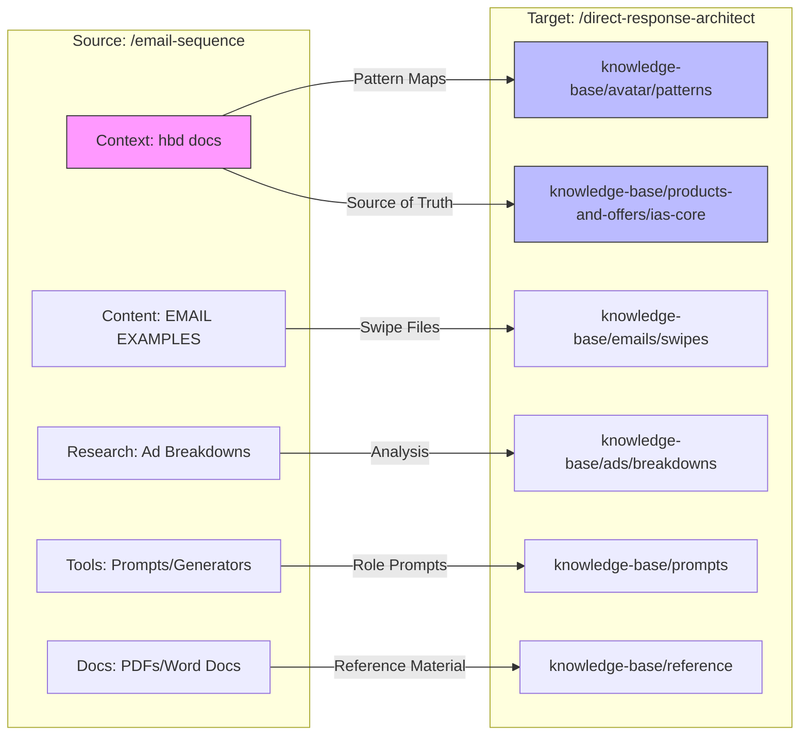

# Migration Visual Plan

You asked for a clear diagram. Here is how the files will move.

## 1. The "Napkin Sketch" (ASCII)
If the diagram below doesn't load, this text version shows the exact same flow.

```text
[ SOURCE: /email-sequence ]                      [ TARGET: /direct-response-architect ]
      |                                                        |
      |-- hbd docs ----------------------------------------->  |-- knowledge-base/products-and-offers/ias-core
      |   (Source Truth, Pattern Maps)                         |-- knowledge-base/avatar/patterns
      |                                                        |
      |-- EMAIL EXAMPLES ----------------------------------->  |-- knowledge-base/emails/swipes
      |   (Excel, CSV dumps)                                   |
      |                                                        |
      |-- Prompts ------------------------------------------>  |-- knowledge-base/prompts
      |   ("Act as copy chief...")                             |
      |                                                        |
      |-- Ad Breakdown ------------------------------------->  |-- knowledge-base/ads/breakdowns
      |                                                        |
      |-- Docs (PDFs) -------------------------------------->  |-- knowledge-base/reference
```

## 2. The Logic Table

| Source Content | New Home | Why? |
| :--- | :--- | :--- |
| **IAS Core Docs** | `kb/products-and-offers/ias-core` | Keeps the product "Start Here" documents together. |
| **Swipe Files** | `kb/emails/swipes/raw` | Archives the raw data for analysis later. |
| **Prompts** | `kb/prompts` | Organizes your AI engineering assets. |
| **Ads/Analysis** | `kb/ads/breakdowns` | Groups marketing assets by type. |

## 3. Mermaid Diagram (For Renderers)


