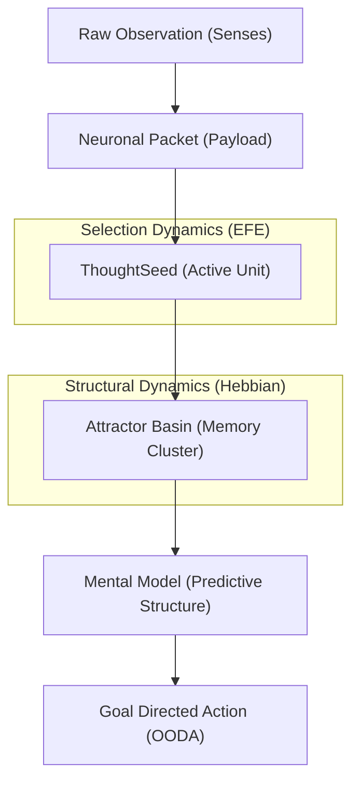

# Mental Model Dynamics & Neuronal Packets

This document formalizes the implementation of **Mental Model Dynamics** within Dionysus 3 Core, bridging Yufik’s Neuronal Packet Theory with Active Inference (Markov Blankets and Expected Free Energy).

## 1. The Hierarchy of Intelligence

The system operates on a multi-scale hierarchy where raw information is transformed into stable predictive structures.

## 2. Neuronal Packets: The Unit of Context

Based on **Yufik (2019/2021)**, Neuronal Packets are the fundamental "connective tissue" of the system's memory.

- **Implementation**: In `api/models/thought.py`, every `ThoughtSeed` contains a `neuronal_packet` dictionary.
- **Function**: The packet encapsulates a "synergistic whole"—a group of related data points that reduce the "degrees of freedom" during reasoning.
- **Synergy Boost**: When one seed in a packet is activated, the `ModelService` applies a **Synergistic Boost**, reducing the EFE (desirability distance) of all other seeds in that same packet.

## 3. Mental Model Dynamics

### A. EFE Minimization (Selection)
Instead of simple matching, the system selects thoughts and models by minimizing **Expected Free Energy (EFE)** in the `EFEEngine`:

$$EFE = \frac{1}{\text{Precision}} \cdot \text{Uncertainty} + \text{Precision} \cdot \text{Goal Divergence}$$

- **Uncertainty**: The Shannon entropy of the prediction.
- **Divergence**: The distance between the current state and the goal state.

### B. Metaplasticity (Self-Tuning)
The `MetaplasticityController` provides second-order learning:
- **Precision Modulation**: High surprise (prediction error) triggers a "zoom out" (lower precision), increasing curiosity. Low surprise triggers a "zoom in" (higher precision), increasing focus.
- **Stress Response**: High sustained error (stress) autonomously reduces the learning rate to prevent core model corruption.

### C. Emergent Basins (Consolidation)
The `MemoryBasinRouter` implements **Hebbian-style strengthening**:
- **Strengthening**: Every successful memory ingestion increases the `strength` and `stability` of the associated Attractor Basin in Neo4j.
- **Self-Organization**: As basins stabilize, they become "gravitational wells" that pull future observations into established patterns.

## 4. The CGR3 Connective Tissue

The **Context Graph (CGR3)** integration serves as the "repair mechanism" for this hierarchy. When a Mental Model encounters a **Surprise** that it cannot resolve via its current Attractor Basins, it triggers a **Discovery Task**:

1. **Gap Detection**: Identify entities with no relational context.
2. **Multi-hop Reasoning**: Use `macer_discover` to bridge the gap.
3. **Reification**: Add new $(h, r, t, rc)$ quadruples to the graph, effectively forming a new Neuronal Packet to update the Mental Model.

---
*Reference: Feature 005 (Mental Models), Feature 038 (ThoughtSeeds), Feature 020 (Coordination Pool)*
